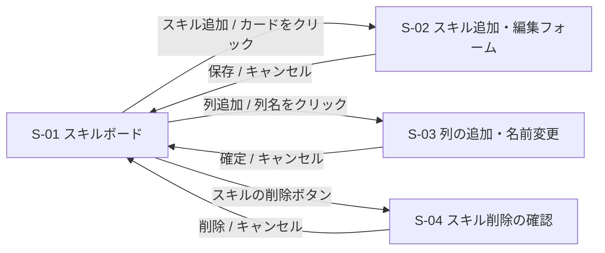

# 03. 画面一覧

## 1. 画面一覧

画面遷移のない**1画面**のアプリ。ダイアログやその場での編集で、すべての操作を行う。

| ID | 画面・部品 | パス | 概要 |
|---|---|---|---|
| S-01 | スキルボード | `/` | 列とスキルカードを表示する、アプリで唯一の画面 |
| S-02 | スキル追加・編集フォーム | (S-01 の上に重ねて表示) | スキルの追加と編集 |
| S-03 | 列の追加・名前変更 | (S-01 の上でその場で編集) | 列の追加と名前変更 |
| S-04 | スキル削除の確認 | (S-01 の上に重ねて表示) | スキルを削除する前の確認 |

## 2. S-01 スキルボード

### 2.1 レイアウト

```
┌────────────────────────────────────────────────────────────────────────────┐
│  skill-map                                                                 │
├────────────────────────────────────────────────────────────────────────────┤
│                                                                            │
│  ┌─ 未習得 (2) ────┐  ┌─ 習得中 (1) ────┐  ┌─ 習得済み (1) ──┐  ┌─────────┐ │
│  │ ┌─────────────┐ │  │ ┌─────────────┐ │  │ ┌─────────────┐ │  │+ 列を追加│ │
│  │ │受発注の操作 │ │  │ │請求書の発行 │ │  │ │レジ締め     │ │  └─────────┘ │
│  │ │優先度: 高   │ │  │ │優先度: 中   │ │  │ │優先度: 中   │ │              │
│  │ │期限: 10/31  │ │  │ │期限: 10/15  │ │  │ │期限: -      │ │              │
│  │ │習得日: -    │ │  │ │習得日: -    │ │  │ │習得日: 9/1  │ │              │
│  │ │ポイント:    │ │  │ │ポイント:    │ │  │ │ポイント:    │ │              │
│  │ │手順書を先に │ │  │ │締め日に注意 │ │  │ │現金の過不足 │ │              │
│  │ │読む         │ │  │ │             │ │  │ │を確認       │ │              │
│  │ │        [削除]│ │  │ │        [削除]│ │  │ │        [削除]│ │              │
│  │ └─────────────┘ │  │ └─────────────┘ │  │ └─────────────┘ │              │
│  │ ┌─────────────┐ │  │                 │  │                 │              │
│  │ │ ...         │ │  │                 │  │                 │              │
│  │ └─────────────┘ │  │                 │  │                 │              │
│  │ [+ スキルを追加]│  │ [+ スキルを追加]│  │ [+ スキルを追加]│              │
│  └─────────────────┘  └─────────────────┘  └─────────────────┘              │
└────────────────────────────────────────────────────────────────────────────┘
```

- 列は横に並べ、ボードの幅を超える場合は横にスクロールする
- 各列の見出しに、列名とスキルの件数を表示する
- **列には削除ボタンを置かない**

### 2.2 表示項目

**列の見出し**

| 項目 | 内容 |
|---|---|
| 列名 | クリックすると、その場で名前を編集できる |
| スキルの件数 | 列内のスキルの件数 |

**スキルカード**

| 項目 | 内容 |
|---|---|
| スキル名 | 太字で表示 |
| 優先度 | 高 / 中 / 低。色付きのバッジで表示する(色だけに頼らず、文字も出す) |
| 期限 | 日付。期限を過ぎていて、習得済み列にないスキルは強調して表示する |
| 習得日 | 日付。値がなければ「-」。**編集はできない** |
| ポイント・考察 | 自由記述。長い場合は数行で省略し、クリックで全文を見られる |
| 削除ボタン | 確認ダイアログを経て削除する |

### 2.3 操作

| 操作 | 動作 | 機能ID |
|---|---|---|
| ページを開く | ボード全体を取得して表示 | F-01 |
| 列の「+ スキルを追加」をクリック | S-02 を追加モードで開く | F-02 |
| カードをクリック | S-02 を編集モードで開く | F-03 |
| カードの削除ボタンをクリック | S-04 を表示し、了承すると削除 | F-04 |
| カードをドラッグ&ドロップ | 列間の移動と列内の並び替え | F-05、F-06 |
| 「+ 列を追加」をクリック | S-03 で列名を入力して追加 | F-07 |
| 列名をクリック | S-03 でその場で名前を編集 | F-08 |

### 2.4 状態

| 状態 | 表示 |
|---|---|
| 読み込み中 | 「読み込み中」を表示 |
| 取得に失敗 | エラーメッセージと「再読み込み」ボタン |
| スキルがない列 | 「スキルがありません」を薄く表示。ドロップ先としても使える |
| 保存に失敗(移動など) | 元の位置に戻し、画面の上部にエラーメッセージを出す |

## 3. S-02 スキル追加・編集フォーム

ダイアログで表示する。

```
┌──────────────────────────────────────┐
│ スキルを追加                      [×] │
├──────────────────────────────────────┤
│ スキル名 *                            │
│ [                                  ] │
│                                      │
│ 優先度      [ 中 ▼ ]                 │
│ 期限        [ 2026-10-31 ]           │
│                                      │
│ ポイント・考察                        │
│ [                                  ] │
│ [                                  ] │
│                                      │
│ 習得日: -   (自動で記録されます)      │
│                                      │
│            [キャンセル]  [保存]       │
└──────────────────────────────────────┘
```

| 項目 | 入力 | 備考 |
|---|---|---|
| スキル名 | テキスト。必須、100文字以内 | 空のときは保存できない。エラーを表示する |
| 優先度 | 選択(高 / 中 / 低) | 追加時の初期値は「中」 |
| 期限 | 日付。任意 | 空にできる |
| ポイント・考察 | 複数行のテキスト。任意、5,000文字以内 | |
| 習得日 | **表示のみ** | 編集モードでのみ表示する。入力はできない |

## 4. S-03 列の追加・名前変更

- 「+ 列を追加」をクリックすると、列名の入力欄がその場に開く。Enter で確定、Esc でキャンセル
- 既存の列名をクリックすると、入力欄に切り替わる。Enter または入力欄の外のクリックで確定、Esc でキャンセル
- 列名は必須、50文字以内
- 列は削除できない。そのため、列の追加欄に「追加した列は削除できません。名前は後から変更できます」と注意書きを表示する

## 5. S-04 スキル削除の確認

```
┌────────────────────────────────┐
│ 「受発注の操作」を               │
│ 削除しますか?                   │
│ この操作は取り消せません。        │
│                                │
│        [キャンセル]  [削除]      │
└────────────────────────────────┘
```

## 6. 画面遷移

画面遷移はない。S-01 の上で、S-02、S-03、S-04 が開いたり閉じたりする。


