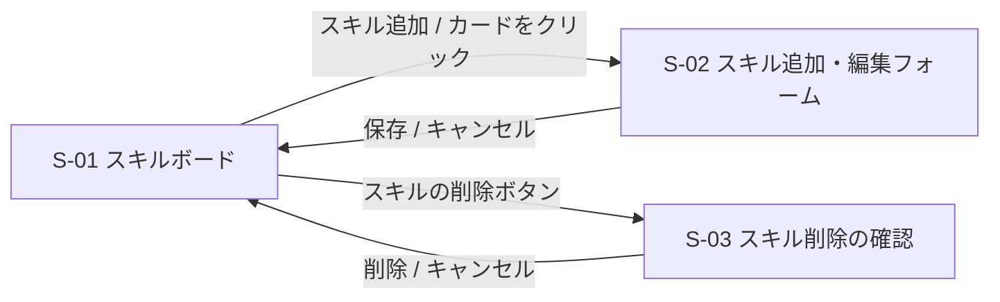

# 03. 画面一覧

## 1. 画面一覧

画面遷移のない**1画面**のアプリ。ダイアログで、追加・編集・削除の確認を行う。

| ID | 画面・部品 | パス | 概要 |
|---|---|---|---|
| S-01 | スキルボード | `/` | 3つの列とスキルカードを表示する、アプリで唯一の画面 |
| S-02 | スキル追加・編集フォーム | (S-01 の上に重ねて表示) | スキルの追加と編集 |
| S-03 | スキル削除の確認 | (S-01 の上に重ねて表示) | スキルを削除する前の確認 |

## 2. S-01 スキルボード

### 2.1 レイアウト

```
┌──────────────────────────────────────────────────────────────────────┐
│  skill-map                                                           │
├──────────────────────────────────────────────────────────────────────┤
│                                                                      │
│  ┌─ 未習得 (2) ─[優先度順]┐ ┌─ 習得中 (1) ─[優先度順]┐ ┌─ 習得済み (1) ──┐ │
│  │ ┌───────────────┐ │ │ ┌───────────────┐ │ │ ┌───────────────┐ │ │
│  │ │受発注の操作   │ │ │ │請求書の発行   │ │ │ │レジ締め       │ │ │
│  │ │優先度: 高     │ │ │ │優先度: 中     │ │ │ │優先度: 中     │ │ │
│  │ │期限:2026-10-31│ │ │ │期限:2026-10-15│ │ │ │期限: -        │ │ │
│  │ │手順書を先に   │ │ │ │締め日に注意   │ │ │ │習得日:2026-09-01│ │ │
│  │ │読む           │ │ │ │               │ │ │ │現金の過不足を │ │ │
│  │ │          [削除]│ │ │ │          [削除]│ │ │ │確認する       │ │ │
│  │ └───────────────┘ │ │ └───────────────┘ │ │ │          [削除]│ │ │
│  │ ┌───────────────┐ │ │                   │ │ └───────────────┘ │ │
│  │ │ ...           │ │ │                   │ │                   │ │
│  │ └───────────────┘ │ │                   │ │                   │ │
│  │ [+ スキルを追加]  │ │ [+ スキルを追加]  │ │                   │ │
│  └───────────────────┘ └───────────────────┘ └───────────────────┘ │
└──────────────────────────────────────────────────────────────────────┘
```

- 列は「未習得」「習得中」「習得済み」の3つで固定。追加・名前変更・削除はできない
- 各列の見出しに、列名とスキルの件数を表示する
- 「+ スキルを追加」ボタンと「優先度順」ボタンは、**未習得と習得中の列にだけ**置く(習得済みには置かない)
- 習得日は、**習得済み列のカードにだけ**表示する
- 期限と習得日は、`2026-10-31` の形式(年-月-日)で表示する。ポイント・考察は、「ポイント:」などのラベルなしで、そのまま表示する(上の図は、簡略にしてある)

### 2.2 表示項目

**列の見出し**

| 項目 | 内容 |
|---|---|
| 列名 | 「未習得」「習得中」「習得済み」(変更できない) |
| スキルの件数 | 列内のスキルの件数 |
| 優先度順ボタン | 未習得・習得中の列だけ。押すと、その列を高 → 中 → 低の順に並べ替える(同じ優先度は、もとの順番を保つ)。スキルが2件未満の列と、通信中・ドラッグ中は、押せない |

**スキルカード**

| 項目 | 内容 |
|---|---|
| スキル名 | 太字で表示 |
| 優先度 | 高 / 中 / 低。色付きのバッジで表示する(色だけに頼らず、文字も出す) |
| 期限 | 日付。期限を過ぎていて、習得済み列にないスキルは強調して表示する |
| 習得日 | 日付。**習得済み列のカードにだけ**表示する。**編集はできない** |
| ポイント・考察 | 自由記述。長い場合は数行で省略し、クリックで全文を見られる |
| 削除ボタン | 確認ダイアログを経て削除する |

### 2.3 操作

| 操作 | 動作 | 機能ID |
|---|---|---|
| ページを開く | すべてのスキルを取得して表示 | F-01 |
| 未習得・習得中の列の「+ スキルを追加」をクリック | S-02 を追加モードで開く | F-02 |
| カードをクリック | S-02 を編集モードで開く | F-03 |
| カードの削除ボタンをクリック | S-03 を表示し、了承すると削除 | F-04 |
| カードをドラッグ&ドロップ | 列間の移動と列内の並び替え。**列やカードの上にない所(列の外、列と列のすき間)で離すと、移動せず、元の位置に戻る**。移動の通信中は、次のドラッグと「優先度順」を受け付けない | F-05、F-06 |
| 「優先度順」ボタンをクリック | その列を高 → 中 → 低の順に並べ替える | F-07 |

### 2.4 状態

| 状態 | 表示 |
|---|---|
| 読み込み中 | 「読み込み中」を表示(ページを開いて、スキルの取得を待つあいだ) |
| 取得に失敗 | エラーメッセージと「再読み込み」ボタン |
| 予期しないエラー(画面の表示中) | 「画面の表示中に、エラーが起きました」と「再読み込み」ボタン。保存済みのスキルは、サーバーにあるので失われない |
| 通信中(優先度順) | 押したボタンの文字が「並べ替え中…」になり、通信が終わるまで、ほかの列のボタンも押せない |
| スキルがない列 | 「スキルがありません」を薄く表示。ドロップ先としても使える |
| 保存に失敗(移動、並べ替え) | 失敗の種類で、動きを分ける。**サーバーが、はっきり断った**(入力が正しくない、混み合っているなど): 移動は、元の位置に戻す。並べ替えは、画面をそのままにする。**結果が分からない**(時間切れ、接続断、サーバーの内部エラーなど。サーバーでは、処理できているかもしれない): サーバーから、最新の一覧を取り直して、それに合わせる。取り直しにも失敗したら、いったん元の位置に戻して表示しつつ、「ページを再読み込みして、確かめてください」と案内する。どの場合も、画面の上部に、原因つきのお知らせを出す。お知らせは「閉じる」ボタンで閉じる。次の操作を始めると、消える |
| 移動・並べ替えの通信中 | 次のドラッグ・並べ替えに加えて、**追加・編集・削除も、受け付けない**(ボタンが押せない状態になる)。通信の結果を、あとで画面に反映するときに、途中で行われた、ほかの変更を、巻き込まないため |
| **別の場所で、すでに削除されていた**(編集・削除・移動のときの 404) | 一覧を、サーバーから取り直して、画面の上部に「「○○」は、すでに削除されていました。最新の状態に更新しました。」と知らせる(失敗ではないので、エラーの見た目にはしない) |

### 2.5 アクセシビリティ(キーボード・スクリーンリーダー)

マウスがなくても、使えるようにする。

| 操作 | キーボード |
|---|---|
| カード間・ボタン間の移動 | Tab(順番: 「優先度順」→ カード → スキル名 → 削除 → 次のカード … → 「+ スキルを追加」) |
| カードの移動 | カードにフォーカスして、Space(または Enter)でつかむ → 矢印キーで動かす → Space で置く。Esc でやめる。置いたあとも、フォーカスは、そのカードに残る |
| 編集を開く | スキル名のボタンで Enter |
| 削除の確認を開く | 「削除」ボタンで Enter(または Space)。削除したあとは、フォーカスが、その列の見出しに移る |

- カードの中のボタン(スキル名・削除)で押したキーは、「カードをつかむ」操作には使わない(カード本体にフォーカスしているときだけ、つかむ)
- 移動中の様子は、日本語で読み上げられる(「○○をつかみました」「○○を、△△の位置に置きました」など)
- ボタンには、名前がある(削除ボタンは「「○○」を削除」)。同じ名前のボタン(「優先度順」「+ スキルを追加」)は、どの列のものかも、補足として読まれる。件数は「3件」と読まれる
- 期限切れは、色だけでなく、文字(「期限切れ」)でも示す。文字の色は、背景との差(コントラスト比)が 4.5 以上(枠線などは 3 以上)になるようにする(`frontend/lib/contrast.test.ts` で確かめている)
- 「動きを減らす」設定(OS の設定)のときは、カードの動く表示を止める

## 3. S-02 スキル追加・編集フォーム

ダイアログで表示する。**閉じるには、「キャンセル」、Esc キー、暗い背景のクリック**のいずれか(右上の「×」ボタンは、設けない)。保存中は、閉じられない。

**追加モード**(習得日の欄は出さない)。見出しには、追加先の列名を付ける(「スキルを追加(未習得)」)

```
┌──────────────────────────────────────┐
│ スキルを追加(未習得)                  │
├──────────────────────────────────────┤
│ スキル名 *                            │
│ [                                  ] │
│                                      │
│ 優先度      [ 中 ▼ ]                 │
│ 期限        [ 2026-10-31 ]           │
│                                      │
│ ポイント・考察                        │
│ [                                  ] │
│ [                                  ] │
│                                      │
│            [キャンセル]  [保存]       │
└──────────────────────────────────────┘
```

**編集モード**(習得済みのスキルの場合だけ、習得日を表示のみで出す)

```
│ ポイント・考察                        │
│ [                                  ] │
│                                      │
│ 習得日: 2026-09-01                   │
│ (自動で記録されるため、編集できません) │
│                                      │
│            [キャンセル]  [保存]       │
```

| 項目 | 入力 | 備考 |
|---|---|---|
| スキル名 | テキスト。必須、100文字以内 | 空のときは保存できない。エラーを表示する |
| 優先度 | 選択(高 / 中 / 低) | 追加時の初期値は「中」 |
| 期限 | 日付。任意 | 空にできる |
| ポイント・考察 | 複数行のテキスト。任意、5,000文字以内 | |
| 習得日 | **表示のみ** | 編集モードで、かつ習得済みのスキルの場合だけ表示する。入力はできない |

## 4. S-03 スキル削除の確認

```
┌────────────────────────────────┐
│ 「受発注の操作」を               │
│ 削除しますか?                   │
│ この操作は取り消せません。        │
│                                │
│        [キャンセル]  [削除]      │
└────────────────────────────────┘
```

## 5. 画面遷移

画面遷移はない。S-01 の上で、S-02 と S-03 が開いたり閉じたりする。


