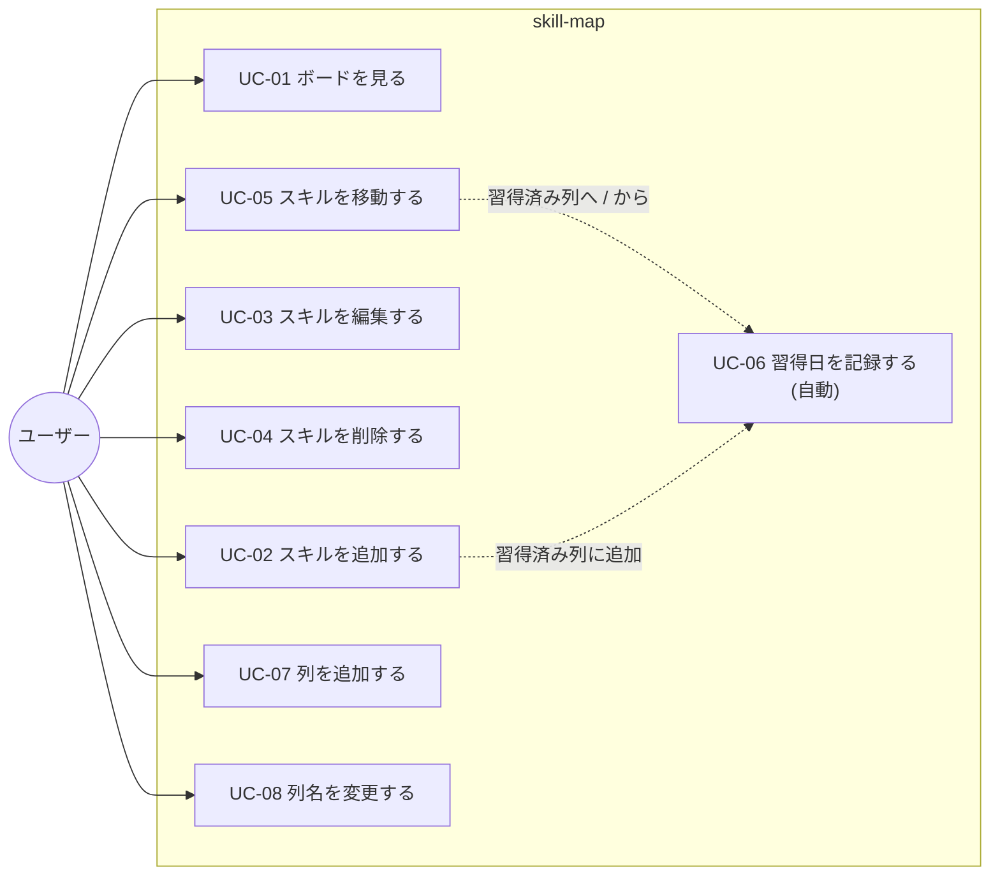
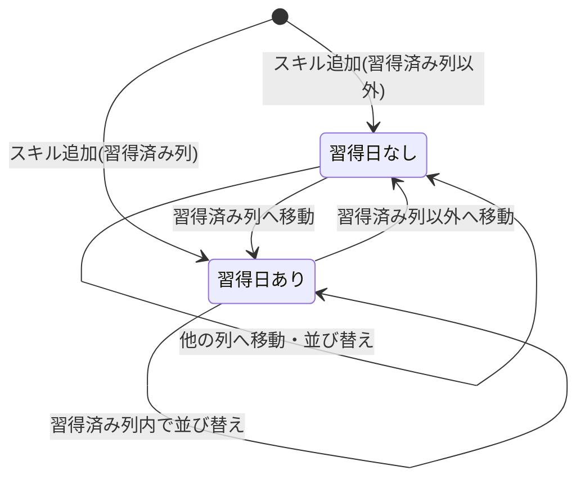

# 04. ユースケース

## 1. 利用者(アクター)

| 利用者 | 説明 |
|---|---|
| ユーザー | スキルを管理する本人。第1段階では唯一の利用者(認証なし) |

## 2. ユースケース一覧

| ID | ユースケース | 対応する機能 |
|---|---|---|
| UC-01 | ボードを見る | F-01 |
| UC-02 | スキルを追加する | F-02 |
| UC-03 | スキルを編集する | F-03 |
| UC-04 | スキルを削除する | F-04 |
| UC-05 | スキルを移動する | F-05 |
| UC-06 | 習得日を記録する(自動) | F-06 |
| UC-07 | 列を追加する | F-07 |
| UC-08 | 列名を変更する | F-08 |

> 列を削除するユースケースはない。

## 3. ユースケースの記述

### UC-01 ボードを見る

- **目的**: 自分のスキルの習得状況を一目で確認する
- **事前条件**: なし
- **基本の流れ**
  1. ユーザーがアプリを開く
  2. システムが、すべての列とスキルを取得して表示する
- **例外の流れ**
  - 2a. 取得に失敗した場合、エラーメッセージと「再読み込み」ボタンを表示する
- **事後条件**: ボードが表示されている

### UC-02 スキルを追加する

- **目的**: 習得したい、または習得したスキルを登録する
- **事前条件**: ボードが表示されている
- **基本の流れ**
  1. ユーザーが、追加したい列の「+ スキルを追加」を押す
  2. システムがスキルの追加フォームを開く
  3. ユーザーがスキル名を入力し、必要なら優先度、期限、ポイント・考察を入力して「保存」を押す
  4. システムがスキルをその列の末尾に追加して表示する
- **例外の流れ**
  - 3a. スキル名が空の場合、エラーを表示して保存しない
  - 3b. 追加先が習得済み列の場合、システムは習得日を記録する(UC-06)
  - 3c. 「キャンセル」を押した場合、何も追加せずに閉じる
- **事後条件**: 新しいスキルが指定した列の末尾にある

### UC-03 スキルを編集する

- **目的**: 学んだ内容や、優先度、期限を更新する
- **事前条件**: 編集するスキルが存在する
- **基本の流れ**
  1. ユーザーがカードをクリックする
  2. システムが、現在の値が入った編集フォームを開く
  3. ユーザーが、スキル名、優先度、期限、ポイント・考察を変更して「保存」を押す
  4. システムが更新して、カードの表示を更新する
- **例外の流れ**
  - 3a. スキル名が空の場合、エラーを表示して保存しない
- **補足**: 習得日は表示のみで、編集できない
- **事後条件**: スキルの内容が更新されている

### UC-04 スキルを削除する

- **目的**: 不要になったスキルを取り除く
- **事前条件**: 削除するスキルが存在する
- **基本の流れ**
  1. ユーザーがカードの削除ボタンを押す
  2. システムが確認ダイアログを表示する
  3. ユーザーが「削除」を押す
  4. システムがスキルを削除し、同じ列の並び順を詰める
- **例外の流れ**
  - 3a. 「キャンセル」を押した場合、何も削除しない
- **事後条件**: スキルが存在しない

### UC-05 スキルを移動する

- **目的**: 習得の進み具合に合わせて、スキルの列を変える。または列内の順番を変える
- **事前条件**: 移動するスキルが存在する
- **基本の流れ**
  1. ユーザーがカードをドラッグして、移動先の列の位置にドロップする
  2. システムが画面を先に更新する
  3. システムが移動を保存し、移動元と移動先の並び順を振り直す
  4. 習得済み列との出入りがあれば、習得日を更新する(UC-06)
- **例外の流れ**
  - 1a. 列の外にドロップした場合、元の位置に戻る
  - 3a. 保存に失敗した場合、元の位置に戻してエラーメッセージを表示する
- **事後条件**: スキルが移動先の位置に保存されている

### UC-06 習得日を記録する(自動)

- **目的**: 習得した日を、手入力なしで正しく残す
- **きっかけ**: スキルが習得済み列に入る、または出るとき
- **ルール**

  | きっかけ | 結果 |
  |---|---|
  | 習得済み列以外 → 習得済み列へ移動 | サーバーの今日の日付を習得日に記録する |
  | 習得済み列 → 習得済み列以外へ移動 | 習得日を消す |
  | 習得済み列内での並び替え | 変更しない |
  | 習得済み列に直接追加 | 追加した日を記録する |

- **補足**: ユーザーは習得日を編集できない。クライアントが習得日を送ってきても、システムは無視する
- **事後条件**: 習得済み列にあるスキルには習得日があり、それ以外にはない

### UC-07 列を追加する

- **目的**: デフォルトの3列以外の状態を表す列を増やす(例: 「研修中」)
- **基本の流れ**
  1. ユーザーが「+ 列を追加」を押す
  2. システムが、列名の入力欄と「追加した列は削除できません」という注意書きを表示する
  3. ユーザーが列名を入力して Enter を押す
  4. システムが、一番右に新しい列を追加する
- **例外の流れ**
  - 3a. 列名が空の場合、追加しない
  - 3b. Esc を押した場合、キャンセルする
- **事後条件**: 新しい空の列が存在する

### UC-08 列名を変更する

- **目的**: 列の呼び名を変える(列は削除できないため、間違えて作った列は名前を変えて使い回す)
- **基本の流れ**
  1. ユーザーが列名をクリックする
  2. システムが入力欄に切り替える
  3. ユーザーが名前を変更して Enter を押す
  4. システムが列名を更新する
- **例外の流れ**
  - 3a. 名前が空の場合、変更せず、元の名前に戻す
- **補足**: 習得済み列も名前は変更できる。名前を変えても、習得日を記録する役割は変わらない
- **事後条件**: 列名が更新されている

## 4. 習得日の状態遷移

