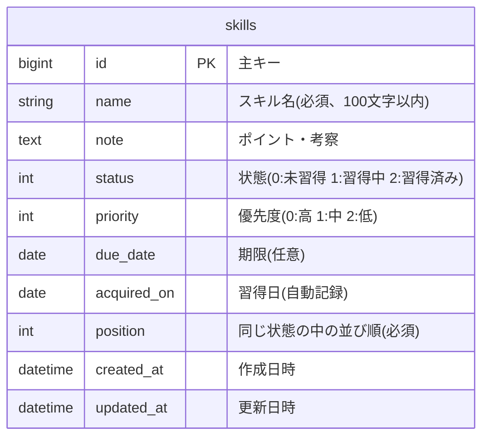
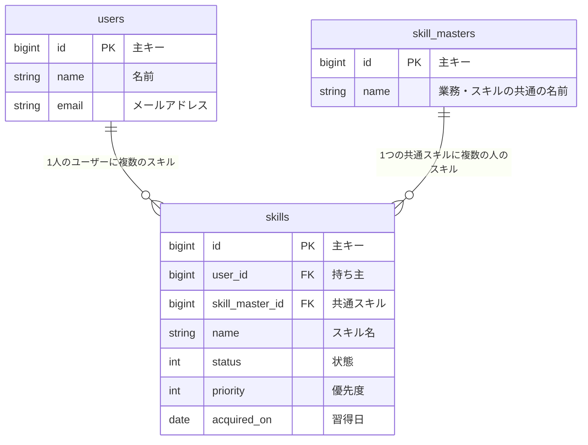

# 05. ER図

テーブル名・カラム名は、実装でそのまま使う英語の名前を使う。意味は日本語で添える。

列は「未習得」「習得中」「習得済み」の3つに固定のため、**列を表すテーブルは持たない**。スキルが「状態(`status`)」を持ち、それが列にあたる。

| テーブル名 | 意味 |
|---|---|
| skills | スキル(状態によって、どの列に表示されるかが決まる) |

## 1. ER図(第1段階)

## 2. テーブル定義

### skills(スキル)

| カラム | 型 | 空欄 | 初期値 | 説明 |
|---|---|---|---|---|
| id | bigint | 不可 | 自動採番 | 主キー |
| name | varchar(100) | 不可 | | スキル名 |
| note | text | 可 | NULL | ポイント・考察 |
| status | int | 不可 | 0 | 状態。0: 未習得、1: 習得中、2: 習得済み |
| priority | int | 不可 | 1 | 優先度。0: 高、1: 中、2: 低 |
| due_date | date | 可 | NULL | 期限 |
| acquired_on | date | 可 | NULL | 習得日。状態が習得済みのときだけ値が入る |
| position | int | 不可 | | 同じ状態の中の並び順(0 始まり、昇順) |
| created_at | datetime | 不可 | | 作成日時 |
| updated_at | datetime | 不可 | | 更新日時 |

**制約・インデックス**

- `status` は、上の3つの値のみ許可する(Rails の enum で管理する)
- `priority` は、上の3つの値のみ許可する(Rails の enum で管理する)
- `(status, position)` に複合インデックスを張る(ボードを状態ごと・並び順に取り出すため)
- `acquired_on` は、API から更新できない。サーバー側のスキル移動・追加の処理だけが書き込む

## 3. 状態と列の対応

| status の値 | Rails の enum の名前 | 列(画面) | スキル追加ボタン | 優先度順ボタン | 習得日の表示 |
|---|---|---|---|---|---|
| 0 | `unlearned` | 未習得 | あり | あり | なし |
| 1 | `learning` | 習得中 | あり | あり | なし |
| 2 | `mastered` | 習得済み | なし | なし | あり |

## 4. 守るべきルール

アプリ側で保証するルール。

| # | ルール |
|---|---|
| 1 | 状態が習得済みのスキルは、習得日が入っている |
| 2 | 状態が習得済みでないスキルは、習得日が空である |
| 3 | スキルは、未習得または習得中でしか作れない。習得済みになるのは、移動したときだけ(そのため、習得済みのスキルは必ず、移動した日の習得日を持つ) |
| 4 | 同じ状態の中では、スキルの並び順は 0 から連番になる |
| 5 | 優先度順の並べ替えは、未習得と習得中に対してだけ行える。同じ優先度は、元の並び順を保つ |

## 5. 将来の拡張

### 5.1 列を増やしたくなったとき

今回は列を固定にして、状態を `skills.status` の値で表している。将来、列を自由に増やしたくなったら、`lists`(列)のテーブルを作り、`skills.status` を `skills.list_id` に置き換える。

### 5.2 複数ユーザー化

第2段階で、ユーザーと「指導できる人」の検索を追加する。今回のテーブルは、次のように拡張する想定。

- `users`: 認証と、スキルの持ち主を表す。既存の `skills` に `user_id` を追加する
- `skill_masters`: 「レジ締め」のような業務・スキルを、人ごとにバラバラに入力するのではなく、共通の名前に紐づける。これにより「このスキルを習得済みの人は誰か」を検索できる
- 指導できる人の検索は、状態が習得済みの `skills` を `skill_master_id` で絞り込んで実現する

これらは今回の実装範囲外。
