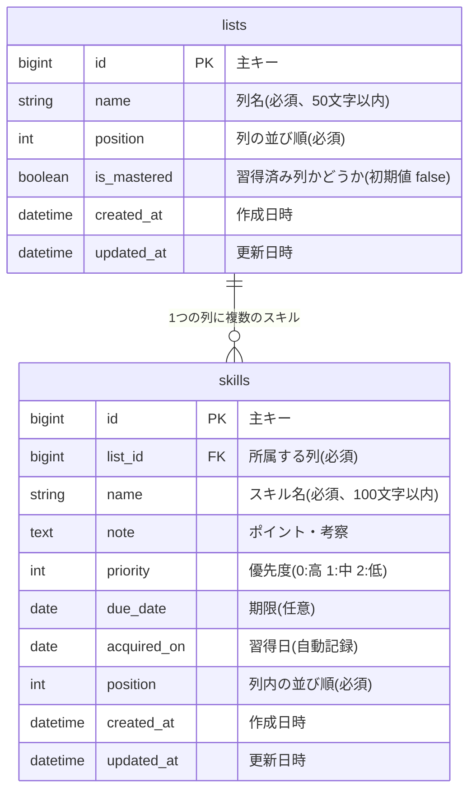
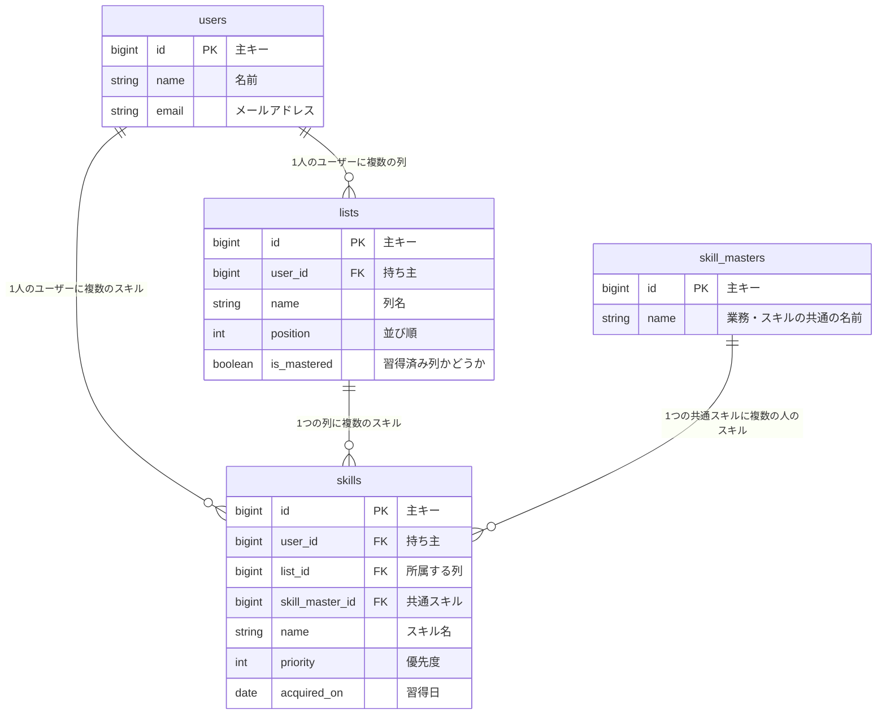

# 05. ER図

テーブル名・カラム名は、実装でそのまま使う英語の名前を使う。意味は日本語で添える。

| テーブル名 | 意味 |
|---|---|
| lists | 列(未習得、習得中、習得済みなど) |
| skills | スキル |

## 1. ER図(第1段階)

## 2. テーブル定義

### lists(列)

| カラム | 型 | 空欄 | 初期値 | 説明 |
|---|---|---|---|---|
| id | bigint | 不可 | 自動採番 | 主キー |
| name | varchar(50) | 不可 | | 列名 |
| position | int | 不可 | | 列の並び順(0 始まり、昇順) |
| is_mastered | tinyint(1) | 不可 | 0 | 習得済み列なら 1 |
| created_at | datetime | 不可 | | 作成日時 |
| updated_at | datetime | 不可 | | 更新日時 |

**制約・インデックス**

- 習得済み列(`is_mastered = 1`)は、全体で1件だけにする
  - MySQL では、条件付きのユニークインデックスが使えない。そのため、モデルの検証と、初期データの投入で担保する
- **列は削除しない。** 削除の API を設けず、モデル側でも削除を拒否する
- `position` に通常のインデックスを張る

### skills(スキル)

| カラム | 型 | 空欄 | 初期値 | 説明 |
|---|---|---|---|---|
| id | bigint | 不可 | 自動採番 | 主キー |
| list_id | bigint | 不可 | | 所属する列(`lists.id`) |
| name | varchar(100) | 不可 | | スキル名 |
| note | text | 可 | NULL | ポイント・考察 |
| priority | int | 不可 | 1 | 優先度。0: 高、1: 中、2: 低 |
| due_date | date | 可 | NULL | 期限 |
| acquired_on | date | 可 | NULL | 習得日。習得済み列にあるときだけ値が入る |
| position | int | 不可 | | 列内の並び順(0 始まり、昇順) |
| created_at | datetime | 不可 | | 作成日時 |
| updated_at | datetime | 不可 | | 更新日時 |

**制約・インデックス**

- 外部キー: `skills.list_id` → `lists.id`
  - 列は削除しないため、列の削除に合わせた特別な処理は不要
- `(list_id, position)` に複合インデックスを張る(ボードの表示順に取り出すため)
- `acquired_on` は、API から更新できない。サーバー側のスキル移動の処理だけが書き込む

## 3. 守るべきルール

アプリ側で保証するルール。

| # | ルール |
|---|---|
| 1 | 習得済み列は常に1つだけ存在する |
| 2 | 列は削除されない |
| 3 | 習得済み列にあるスキルは、習得日が入っている |
| 4 | 習得済み列以外にあるスキルは、習得日が空である |
| 5 | 同じ列の中では、スキルの並び順は 0 から連番になる |
| 6 | 列の並び順は 0 から連番になる |

## 4. 初期データ

アプリの初回起動時に、次の3列を投入する。

| id | name | position | is_mastered |
|---|---|---|---|
| 1 | 未習得 | 0 | false |
| 2 | 習得中 | 1 | false |
| 3 | 習得済み | 2 | true |

## 5. 将来の拡張(複数ユーザー化)

第2段階で、ユーザーと「指導できる人」の検索を追加する。今回のテーブルは、次のように拡張する想定。

- `users`: 認証と、スキルの持ち主を表す。既存の `lists` と `skills` に `user_id` を追加する
- `skill_masters`: 「レジ締め」のような業務・スキルを、人ごとにバラバラに入力するのではなく、共通の名前に紐づける。これにより「このスキルを習得済みの人は誰か」を検索できる
- 指導できる人の検索は、習得済み列にある `skills` を `skill_master_id` で絞り込んで実現する

これらは今回の実装範囲外。第1段階では、拡張しやすい形(列とスキルを分ける、習得済みをフラグで表す)にしておくだけにする。
