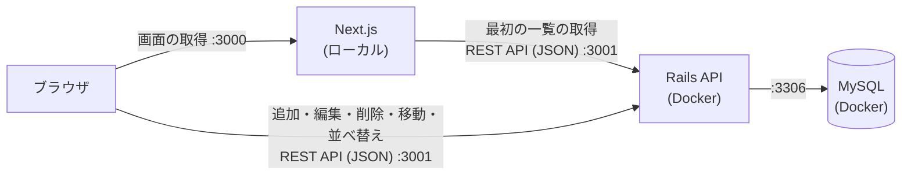
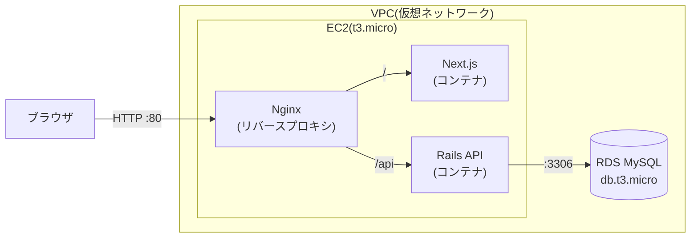

# 06. 技術スタック

## 1. 技術一覧

| 領域 | 採用技術 | 備考 |
|---|---|---|
| フロントエンド | Next.js 16(App Router)+ React 19 + TypeScript 5 | スクール指定。バージョンは `frontend/package.json` で固定 |
| 見た目 | 普通の CSS(`frontend/app/globals.css`) | プロトタイプの CSS を移したもの。Tailwind などは使わない |
| ドラッグ&ドロップ | `@dnd-kit`(core 6、sortable 10) | 列間の移動と、列内の並び替え。マウスとキーボードの両方で操作できる |
| 状態管理・通信 | React の `useState` と、標準の `fetch` | 追加のライブラリ(SWR など)は使わない |
| バックエンド | Ruby on Rails 8.1(API モード)、Ruby 3.4 | スクール指定 |
| CORS(別のオリジンからの通信の許可) | `rack-cors` | 許可するオリジンを限定する(既定は `http://localhost:3000` だけ。環境変数 `CORS_ORIGINS` で変える) |
| データベース | MySQL 8.4 | スクール指定 |
| テスト(バックエンド) | RSpec | API のテストで、移動や習得日のルールを検証する |
| テスト(フロントエンド) | Vitest + Testing Library + jsdom | 画面の部品と、ドロップ位置の決め方などのロジックを検証する。ブラウザの自動操作(Playwright など)は使わない |
| 検査 | ESLint、`tsc`(型検査)、rubocop、brakeman、bundler-audit | まとめて実行: フロントエンドは `npm run check`、バックエンドは `bin/ci` |
| ローカル開発 | Docker Compose(バックエンド)、パソコンの Node.js(フロントエンド) | Rails と MySQL はコンテナ。フロントエンドは Docker を使わない |
| デプロイ | AWS EC2 + RDS | スクール指定。無料利用枠の範囲内 |

### ローカル環境の注意

- この Mac のシステムの Ruby は 2.6.10 と古く、Rails が動かない。Rails と MySQL は Docker Compose で動かし、ローカルに Ruby を入れなくて済むようにする
- Node.js は 24.x を使う(フロントエンドは、パソコンの Node.js で動かす。Docker は使わない)
- サーバーは、必ず `backend/start.sh`(ポート 3001)、`frontend/start.sh`(ポート 3000)から起動する。ポートが使われていても、別のポートには逃がさず、使っているものを止めてから、同じポートで起動する(CLAUDE.md)
- ブラウザでは `http://localhost:3000` を開く。`127.0.0.1:3000` は、バックエンドの CORS の許可に合わず、API を呼べない

## 2. システム構成

### 開発環境



API を呼ぶ人が、2 種類いる。

- **Next.js のサーバー**: ページを開いたときの、スキルの一覧の取得だけ。サーバーどうしの通信なので、CORS は関係ない。場所は環境変数 `API_URL`
- **ブラウザ**: 追加・編集・削除・移動・並べ替え。別のオリジン(3000 番から 3001 番)への通信になるので、Rails 側の CORS の許可が必要。場所は環境変数 `NEXT_PUBLIC_API_URL`(`NEXT_PUBLIC_` で始まる値は、ブラウザに公開される)

どちらも、既定は `http://localhost:3001`(`frontend/.env.example`)。

### 本番環境(AWS)



- ブラウザからは、1つのオリジン(EC2 のパブリック DNS)にアクセスする。Nginx が、`/api` を Rails に、それ以外を Next.js に振り分ける。同一オリジンになるため、本番では CORS の問題が起きにくい。本番では、ブラウザ用の `NEXT_PUBLIC_API_URL` を空にして、同じオリジンの `/api` を呼ぶ(Next.js のサーバー用の `API_URL` は、Rails の場所を指す)
- RDS はパブリックアクセスを無効にする。EC2 のセキュリティグループからの、3306 番ポートの通信だけを許可する
- EC2 のポートは、80 番(HTTP)と、自分の IP アドレスからの 22 番(SSH)だけを開ける

## 3. AWS のコスト対策(課金ゼロが最優先)

**課金を一切発生させないことが、この構成の最優先の制約。** 次のルールを守る。(無料プランの仕組みや、作業のときの確認は、[07. デプロイガイド](07-デプロイガイド.md) を参照する)

### 3.1 リソースの選択

| リソース | 選択 | 理由・注意 |
|---|---|---|
| EC2 | **t3.micro**、1台のみ | このアカウントでは t2.micro が無料枠の対象外で、t3.micro が対象 |
| EBS(ディスク) | 無料枠の範囲(30GB 以内) | 余分なボリュームを作らない |
| RDS | MySQL、**db.t3.micro**、シングル AZ | マルチ AZ は無料枠の対象外 |
| RDS のストレージ | 20GB 以内、汎用 SSD | ストレージの自動拡張は無効にする |
| RDS のバックアップ | 保持期間は最小 | 無料枠を超えるバックアップは課金される |
| RDS の公開設定 | パブリックアクセスなし | EC2 からのみ接続する |

### 3.2 使わないもの

| 使わないもの | 理由 |
|---|---|
| NAT ゲートウェイ | 時間あたりの課金が発生する |
| ロードバランサー(ALB など) | Nginx で代替する |
| Elastic IP(固定 IP) | 未使用のまま放置すると課金される。パブリック DNS で足りる |
| Route 53(ドメイン管理) | ホストゾーンに月額の課金が発生する。独自ドメインは使わない |
| 追加のスナップショット・AMI | 保管料金が発生する |

### 3.3 作業の前後の確認

1. **作業の前**に、Billing コンソールで、無料利用枠の対象と残りの期間を確認する
2. **作業の前**に、AWS Budgets で、0.01 USD を超えたら通知が来るアラートを設定する
3. リソースを作る**たびに**、その構成とサイズが無料枠の対象かを確認する
4. 作業の後、Billing コンソールで、課金が 0 のままであることを確認する
5. 使わないときは、リソースを放置しない(下記の後片付け)

> 無料枠の条件(対象のサイズ、期間、時間数)は、変更されることがある。作業のときに、AWS の公式ページとコンソールの表示で、最新の内容を確認すること。

### 3.4 後片付け

停止しただけでは課金が続くリソースがあるため、使い終わったら**削除**する。

1. EC2 インスタンスを**終了**する(停止ではなく終了)
2. RDS インスタンスを**削除**する(停止しただけだと、一定期間後に自動で再開される)
3. 不要なスナップショット、EBS ボリューム、Elastic IP が残っていないことを確認する
4. Billing コンソールで、課金が発生していないことを確認する

具体的な手順は、デプロイの実装時に README に書く。

## 4. ディレクトリ構成

```
skill-map/
├── backend/             # Rails API(start.sh で起動。ポート 3001)
│   ├── app/
│   │   ├── controllers/api/v1/   # skills_controller
│   │   ├── models/               # Skill
│   │   └── services/             # skill_mover(移動)、skill_sorter(優先度順の並べ替え)
│   ├── db/                       # マイグレーション、初期データ
│   └── spec/                     # RSpec(テスト)
├── frontend/            # Next.js(start.sh で起動。ポート 3000)
│   ├── app/                      # page.tsx(サーバーで一覧を取得)、layout.tsx、loading.tsx、error.tsx、globals.css
│   ├── components/               # 画面の部品(下の表)
│   ├── lib/                      # API クライアント、型、ボードの規則、ドロップ位置の決め方(下の表)
│   └── vitest.config.mts ほか    # テスト・検査の設定(テストは、対象の隣に *.test.ts(x) で置く)
├── prototype/           # 画面確認用の、HTML と CSS だけのプロトタイプ(実装の元にした)
├── docs/                # このドキュメント
├── docker-compose.yml   # 開発用(MySQL + Rails)
├── CLAUDE.md            # このリポジトリでの作業の決まり
└── README.md

(Phase 4 で追加: 本番用の Nginx 設定(`nginx/`)、本番用の Docker 設定)
```

### フロントエンドの部品と役割

| ファイル | 役割 |
|---|---|
| `app/page.tsx` | サーバー側で、API から一覧を取得して、`Board` に渡す。取得に失敗したら、`LoadError` を表示。「今日」の日付(日本時間)も、ここで作って渡す |
| `components/Board.tsx` | ボード全体。スキルの一覧を、状態として持つ。追加・編集・削除・移動・並べ替えの、API 呼び出しと、画面への反映。ドラッグ&ドロップの全体の制御 |
| `components/Column.tsx` / `SkillCard.tsx` / `SortableSkillCard.tsx` | 列 / カード(表示)/ カードにドラッグの動きをつけたもの |
| `components/SkillForm.tsx` / `ConfirmDialog.tsx` / `Modal.tsx` | 追加・編集のフォーム / 削除の確認 / どちらも使う、ダイアログの共通の仕組み(`<dialog>`) |
| `components/LoadError.tsx` / `ReloadButton.tsx`、`app/loading.tsx` / `error.tsx` | 取得に失敗したとき / 読み込み中 / 予期しないエラーのときの画面 |
| `lib/types.ts` | スキルなどの型、状態・優先度の名前 |
| `lib/api.ts` | API の呼び出し(一覧・追加・更新・削除・移動・並べ替え)。API の項目名(`due_date`)と、画面側(`dueDate`)の変換。エラー(`ApiError`) |
| `lib/board.ts` | ボードの規則(移動・並べ替え・削除後の詰め直し・入力チェック・期限切れの判定)。**バックエンドと同じ結果になる**ように作り、テストで確かめる |
| `lib/drag.ts` / `lib/collision.ts` | ドラッグの「どの列の何番目に置くか」を決める部分と、カーソルの下にあるカード・列の判定。画面(React)に依存しない関数にして、細かくテストする |
| `lib/skill-form.ts` | API のエラーを、フォームの項目ごとの表示に直す |

## 5. 設計の方針

| 方針 | 内容 |
|---|---|
| ボード全体を1回で取得 | `GET /skills` で、すべてのスキルをまとめて返し、画面側で状態ごとに列へ分ける。1画面のアプリなので、これが単純で速い |
| 楽観的更新(移動だけ) | ドラッグ&ドロップは、画面を先に更新し、保存に失敗したら元に戻す(習得日は、サーバーの返事の値に置き換える)。追加・編集・削除・優先度順の並べ替えは、サーバーの返事を待ってから、画面を更新する(並び順などを、サーバーが決めるため) |
| サーバーが習得日を決める | 習得日はサーバーの日付で記録し、クライアントの値は使わない |
| 移動・並べ替えの処理を1か所に集約 | スキルの移動と優先度順の並べ替えは、それぞれ1つの処理(サービス)を通す。並び順と習得日の更新を1か所で行う |
| トランザクション | 移動や並べ替えでの並び順の更新と、習得日の更新は、1つのトランザクションにする |
| 最初の一覧は、サーバーで取得 | ページを開いたとき、Next.js のサーバーが API から一覧を取得して、表示する(毎回、最新を取得し、キャッシュしない)。操作のたびの通信は、ブラウザから API を呼ぶ |
| 「今日」は、サーバーで作る | 期限切れの判定に使う「今日」は、サーバーで日本時間の日付を作って、画面に渡す(サーバーとブラウザで、日付がずれて、表示が食い違うのを防ぐ) |
| 規則は、画面から切り離す | 移動・並べ替えの結果の決め方や、ドロップ位置の決め方は、React に依存しない関数(`lib/`)にして、テストで確かめる。画面側の規則(`lib/board.ts`)がバックエンドと同じ結果になることは、開発中に、実際のバックエンドに対する、ランダムな移動・並べ替えで確かめた(常に実行するテストではない) |
| エラーの伝え方 | 入力の間違い(422)は、その項目の下に表示する。通信の失敗などは、画面の上のお知らせ、または、取得の失敗の画面(「再読み込み」ボタン付き)で伝える |
| キーボード・スクリーンリーダー | カードの移動は、キーボードでもできる(Space でつかむ、矢印で動かす、Space で置く、Esc でやめる)。読み上げは日本語。文字の色は、コントラスト比 4.5 以上(`docs/03-画面一覧.md` の 2.5) |
| 列は固定 | 列は「未習得」「習得中」「習得済み」の3つに固定し、テーブルは持たない。スキルの状態(`status`)を enum で表す。列の追加・削除が要らないので、API とデータがシンプルになる |
| 拡張しやすい形 | 複数ユーザー化のときは `user_id` を足せばよい。列を増やしたくなったら、列のテーブルを作って `status` を置き換える |

## 6. 開発の進め方

| 段階 | 内容 |
|---|---|
| Phase 0 | リポジトリの準備(完了) |
| Phase 1 | ドキュメントの作成(このドキュメント)と承認 |
| Phase 2 | バックエンド: Docker Compose、マイグレーション、モデル、API、テスト |
| Phase 3 | フロントエンド: ボード表示、追加・編集・削除、ドラッグ&ドロップ、優先度順の並べ替え、API との接続(完了) |
| Phase 4 | デプロイ: 本番用の Docker 設定、EC2 + RDS へのデプロイ、動作確認、後片付けの手順 |
