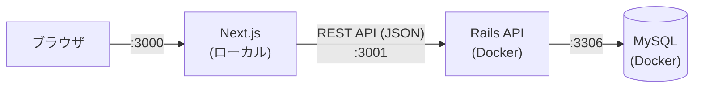
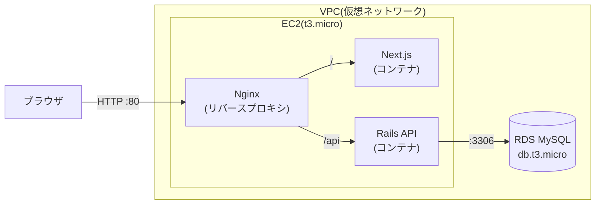

# 06. 技術スタック

## 1. 技術一覧

| 領域 | 採用技術 | 備考 |
|---|---|---|
| フロントエンド | Next.js(App Router)+ TypeScript | スクール指定 |
| ドラッグ&ドロップ | `@dnd-kit` | 列間の移動と、列内の並び替え |
| バックエンド | Ruby on Rails(API モード) | スクール指定。Rails の最新の安定版を使う |
| CORS(別のオリジンからの通信の許可) | `rack-cors` | 許可するオリジンを限定する |
| データベース | MySQL | スクール指定 |
| テスト | RSpec(バックエンド) | API のテストで、移動や習得日のルールを検証する |
| ローカル開発 | Docker Compose | Rails と MySQL をコンテナで動かす |
| デプロイ | AWS EC2 + RDS | スクール指定。無料利用枠の範囲内 |

### ローカル環境の注意

- この Mac のシステムの Ruby は 2.6.10 と古く、Rails が動かない。Rails と MySQL は Docker Compose で動かし、ローカルに Ruby を入れなくて済むようにする
- Node.js は 24.x を使う

## 2. システム構成

### 開発環境



### 本番環境(AWS)



- ブラウザからは、1つのオリジン(EC2 のパブリック DNS)にアクセスする。Nginx が、`/api` を Rails に、それ以外を Next.js に振り分ける。同一オリジンになるため、本番では CORS の問題が起きにくい
- RDS はパブリックアクセスを無効にする。EC2 のセキュリティグループからの、3306 番ポートの通信だけを許可する
- EC2 のポートは、80 番(HTTP)と、自分の IP アドレスからの 22 番(SSH)だけを開ける

## 3. AWS のコスト対策(課金ゼロが最優先)

**課金を一切発生させないことが、この構成の最優先の制約。** 次のルールを守る。

### 3.1 リソースの選択

| リソース | 選択 | 理由・注意 |
|---|---|---|
| EC2 | **t3.micro**、1台のみ | このアカウントでは t2.micro が無料枠の対象外で、t3.micro が対象 |
| EBS(ディスク) | 無料枠の範囲(30GB 以内) | 余分なボリュームを作らない |
| RDS | MySQL、**db.t3.micro**、シングル AZ | マルチ AZ は無料枠の対象外 |
| RDS のストレージ | 20GB 以内、汎用 SSD | ストレージの自動拡張は無効にする |
| RDS のバックアップ | 保持期間は最小 | 無料枠を超えるバックアップは課金される |
| RDS の公開設定 | パブリックアクセスなし | EC2 からのみ接続する |

### 3.2 使わないもの

| 使わないもの | 理由 |
|---|---|
| NAT ゲートウェイ | 時間あたりの課金が発生する |
| ロードバランサー(ALB など) | Nginx で代替する |
| Elastic IP(固定 IP) | 未使用のまま放置すると課金される。パブリック DNS で足りる |
| Route 53(ドメイン管理) | ホストゾーンに月額の課金が発生する。独自ドメインは使わない |
| 追加のスナップショット・AMI | 保管料金が発生する |

### 3.3 作業の前後の確認

1. **作業の前**に、Billing コンソールで、無料利用枠の対象と残りの期間を確認する
2. **作業の前**に、AWS Budgets で、0.01 USD を超えたら通知が来るアラートを設定する
3. リソースを作る**たびに**、その構成とサイズが無料枠の対象かを確認する
4. 作業の後、Billing コンソールで、課金が 0 のままであることを確認する
5. 使わないときは、リソースを放置しない(下記の後片付け)

> 無料枠の条件(対象のサイズ、期間、時間数)は、変更されることがある。作業のときに、AWS の公式ページとコンソールの表示で、最新の内容を確認すること。

### 3.4 後片付け

停止しただけでは課金が続くリソースがあるため、使い終わったら**削除**する。

1. EC2 インスタンスを**終了**する(停止ではなく終了)
2. RDS インスタンスを**削除**する(停止しただけだと、一定期間後に自動で再開される)
3. 不要なスナップショット、EBS ボリューム、Elastic IP が残っていないことを確認する
4. Billing コンソールで、課金が発生していないことを確認する

具体的な手順は、デプロイの実装時に README に書く。

## 4. ディレクトリ構成

```
skill-map/
├── backend/             # Rails API
│   ├── app/
│   │   ├── controllers/api/v1/   # skills_controller
│   │   ├── models/               # Skill
│   │   └── services/             # スキル移動・優先度順の並べ替えの処理
│   ├── db/                       # マイグレーション、初期データ
│   └── spec/                     # RSpec(テスト)
├── frontend/            # Next.js
│   ├── app/                      # page.tsx
│   ├── components/               # Board, Column, SkillCard, SkillForm など
│   └── lib/                      # API クライアント、型定義
├── nginx/               # 本番用の Nginx 設定
├── docs/                # このドキュメント
├── docker-compose.yml   # 開発用(MySQL + Rails)
└── README.md
```

## 5. 設計の方針

| 方針 | 内容 |
|---|---|
| ボード全体を1回で取得 | `GET /skills` で、すべてのスキルをまとめて返し、画面側で状態ごとに列へ分ける。1画面のアプリなので、これが単純で速い |
| 楽観的更新 | ドラッグ&ドロップは、画面を先に更新し、保存に失敗したら元に戻す |
| サーバーが習得日を決める | 習得日はサーバーの日付で記録し、クライアントの値は使わない |
| 移動・並べ替えの処理を1か所に集約 | スキルの移動と優先度順の並べ替えは、それぞれ1つの処理(サービス)を通す。並び順と習得日の更新を1か所で行う |
| トランザクション | 移動や並べ替えでの並び順の更新と、習得日の更新は、1つのトランザクションにする |
| 列は固定 | 列は「未習得」「習得中」「習得済み」の3つに固定し、テーブルは持たない。スキルの状態(`status`)を enum で表す。列の追加・削除が要らないので、API とデータがシンプルになる |
| 拡張しやすい形 | 複数ユーザー化のときは `user_id` を足せばよい。列を増やしたくなったら、列のテーブルを作って `status` を置き換える |

## 6. 開発の進め方

| 段階 | 内容 |
|---|---|
| Phase 0 | リポジトリの準備(完了) |
| Phase 1 | ドキュメントの作成(このドキュメント)と承認 |
| Phase 2 | バックエンド: Docker Compose、マイグレーション、モデル、API、テスト |
| Phase 3 | フロントエンド: ボード表示、追加・編集・削除、ドラッグ&ドロップ、優先度順の並べ替え、API との接続 |
| Phase 4 | デプロイ: 本番用の Docker 設定、EC2 + RDS へのデプロイ、動作確認、後片付けの手順 |
