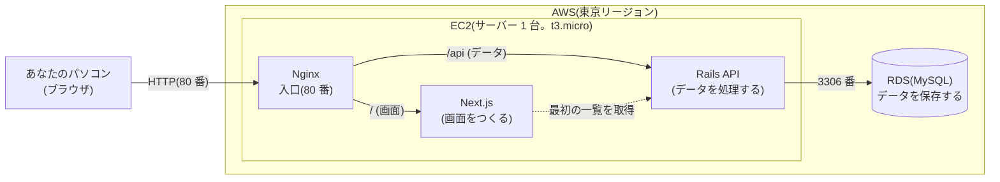
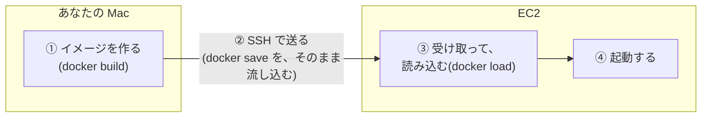
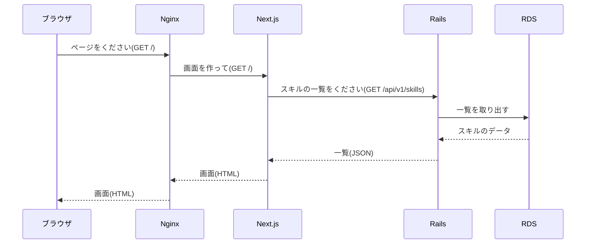
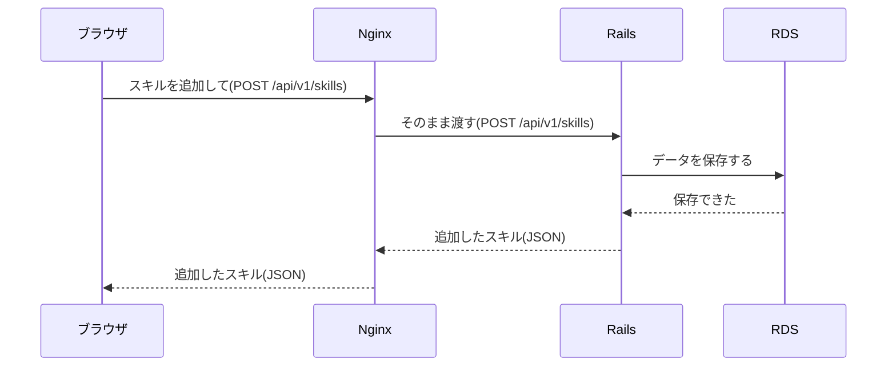

# 07. デプロイガイド

Phase 4(AWS の EC2 + RDS へのデプロイ)に入る前に、あなたが読んで、全体像と、守ることが分かるようにするためのガイドです。

> **このガイドは、5 つの部に分けて、1 部ずつ作ります。** いまは、**第 3 部**までです。
>
> | 部 | 内容 | 状態 |
> |---|---|---|
> | 第 1 部 | 絶対に守ること、費用の仕組み | 完了 |
> | 第 2 部 | 全体像と、用語の説明 | 完了 |
> | **第 3 部** | **事前準備のチェックリスト(あなたがやること)** | **この文書** |
> | 第 4 部 | Phase 4 の段取り(だれが何をするか) | これから |
> | 第 5 部 | 後片付け、うまくいかないとき、緊急時 | これから |

**このガイドを書いている時点では、AWS には、何も作っていません。**(費用は 0 です)

---

# 第 1 部: 絶対に守ること・費用の仕組み

## 1.1 絶対に守ること

**「必ず無料の範囲で行う」**ことが、いちばん大事なルールです。次の 10 か条を、Phase 4 のあいだ、いつも守ります。

| # | 守ること | 担当 |
|---|---|---|
| 1 | **「有料プランへのアップグレード(Upgrade)」は、絶対にしない。** 画面に「アップグレード」の案内が出ても、押さない | あなた |
| 2 | 自動で有料プランになる操作をしない(**AWS Organizations への参加・作成**、**IAM Identity Center の「有効にする」**(組織が、自動で作られる)、Control Tower、AWS パートナーネットワークへの参加、など。1.2 の表と、第 3 部の 3.2) | あなた |
| 3 | **作る前に、「無料ゲート」を通す**(下の 1.1.1)。リソースを作る画面で、**「作成」を押す前に、私(Claude)に、画面の表示を見せる。私が「OK」と言ってから、押す** | あなた+私 |
| 4 | 私は、AWS のリソースを、**勝手に作らない・変えない**。AWS の操作は、あなたが、コンソール(AWS の Web 画面)で行う。私が、コマンドで操作する必要があるときも、内容を見せて、あなたが**承認してから** | 私 |
| 5 | **最初に、予算アラート(AWS Budgets)を設定する。** 設定できたことを、私が確認してから、次に進む | あなた+私 |
| 6 | リソースを作った**直後**にも、「請求とコスト管理」の画面で、**クレジット残高**を確認する。想定外の減り方があれば、その場で止める | あなた+私 |
| 7 | **放置しない。** リソースを作る前に「いつ削除するか」を決める。使い終わったら、**その日のうちに、削除**する(削除の手順は、第 5 部) | あなた |
| 8 | **使わないと決めたもの**を、作らない: NAT ゲートウェイ、ロードバランサー、Elastic IP(固定 IP)、Route 53(ドメイン)、追加のスナップショット・AMI、複数台、マルチ AZ、大きいストレージ、有料の追加機能 | あなた+私 |
| 9 | **無料の条件は、変わることがある。** 私の記憶では、断定しない。作業の時点で、AWS の画面と、公式ページで確認する | 私 |
| 10 | **不安になったら、止める。** 「たぶん大丈夫」で、進まない。分からない表示が出たら、押さずに、私に見せる | あなた+私 |

### 1.1.1 「無料ゲート」(リソースを作る画面で、「作成」を押す前の確認)

EC2(サーバー)、RDS(データベース)、ストレージなど、リソースを作る**すべての画面**で、「作成」を押す**前に**、次を確認します。

1. 画面に、**「無料利用枠の対象(Free tier eligible)」**などの表示がある(または、無料プランで使えることが、画面から分かる)
2. サイズ・台数・ストレージが、**このガイドで決めた表どおり**(第 4 部で示します。目安: EC2 は **t3.micro を 1 台**、RDS は **db.t3.micro・シングル AZ・ストレージ 20GB 以内・自動拡張オフ・パブリックアクセスなし**)
3. 「**有料プランが必要**」「**無料プランでは利用できません**」のような表示が、出ていない
4. 料金の見積もりや、月額の表示が出る場合は、**私に見せる**(無料プランでは、その分が、クレジットから引かれる目安になります。1.3 を参照)

**どれか 1 つでも、確認できない・分からないときは、「作成」を押さずに、私に画面を見せてください。** 私も、不明な点を「たぶん大丈夫」で通しません。

> **RDS が、無料プランで作れない・無料の表示が出ないとき**は、作らずに止めて、相談します。(代替案は、EC2 の上で、MySQL を動かす方法です。ただし、学校の指定が「EC2 + RDS」なので、その場合は、あなたが判断します)

---

## 1.2 あなたのアカウントの「無料プラン」の仕組み

あなたの AWS アカウントは、**無料プラン(クレジット方式)**です(あなたに、確認してもらいました)。次は、AWS の**公式ドキュメントで、確認した内容**です。

| 項目 | 内容 |
|---|---|
| クレジット | **$100** のクレジットが、最初に付く。決まった操作を行うと、**最大 $100 が追加**で、もらえる(合計 最大 $200) |
| 期間 | **6 か月**、または**クレジットを使い切るまで**。どちらか早いほう |
| 課金 | 無料プランの間は、**請求(あなたのお金)は、発生しない**。公式の説明(意訳): 「無料アカウントプランは、サービスを試している間、料金が発生しないことを保証する」 |
| 期間が終わると | **アカウントが自動で閉じて、リソースとデータに、アクセスできなくなる。** AWS は、データを 90 日間、保管する。90 日以内に「有料プラン」に切り替えれば、アカウントを続けられる(この場合は、通常の料金が、かかる) |
| 使えないもの | クレジットを一気に使い切りうるもの(Savings Plans、リザーブドインスタンス、一部の AWS Marketplace の商品)、ハードウェアの購入は、無料プランでは使えない |
| **自動で有料プランになる操作** | **AWS Organizations に参加する(作る)**、**IAM Identity Center を有効にする(組織が、自動で作られる)**、Control Tower を設定する、AWS パートナーネットワークに参加する、Professional Services の契約を作る、エンタープライズ契約を結ぶ、Skill Builder のチーム購読を購入する、アカウントを HIPAA・SEC 準拠に指定する。**これらは、しない**(1.1 の 2) |
| 他のクレジット | 無料プランは、他のキャンペーンのクレジットや割引の対象にならない |
| 対象の EC2 | 2025 年 7 月 15 日以降に作ったアカウントで、「無料利用枠の対象」と表示されるのは、**t3.micro、t3.small、t4g.micro、t4g.small、c7i-flex.large、m7i-flex.large**(EC2 の公式ドキュメント)。**t2.micro は対象外**(あなたのアカウントの状況と、合っています) |
| 対象のストレージ(EBS) | 対象と表示されるのは、standard、st1、sc1、gp2、gp3(公式ドキュメント)。**容量の上限は、確認できていない**(1.4) |
| 確認する場所 | AWS の「**請求とコスト管理**(Billing and Cost Management)」のホーム画面。**無料プランの期限、クレジット残高、残りの日数**が見られる |

## 1.3 「無料」の 2 つの意味 — 大事な注意

無料プランでは、「無料」に、**2 つの意味**があります。分けて考えます。

| | 意味 | このプロジェクトでの扱い |
|---|---|---|
| **① 現金の請求が 0 円** | あなたのお金は、かからない | 無料プランのままなら、**公式に保証**されている(ただし、有料プランに切り替えない場合)。**絶対に守る** |
| **② クレジットも、なるべく減らさない** | クレジットの残高は、6 か月の間の、「使える量」 | 下の「公式に書いてあること」から、**サーバーやデータベースを動かすと、その分、クレジットが減る可能性が高い**と、私は考えている(**推測**。1.4 で、作業のときに、確かめる)。だから、**動かす時間を短くして、使い終わったら、すぐ削除する** |

**公式に書いてあること(意訳)と、そこからの推測:**

- 公式の FAQ: 「無料の上限を超えると、通常の料金での課金が始まる。ただし、無料プランのアカウントは、請求書に、料金が表示されない」
- EC2 の公式ドキュメント: 2025 年 7 月 15 日以降のアカウントでは、無料の「使用量の上限」は、**クレジット($100 + 最大 $100)**で示され、「無料利用枠の上限を超えることは、できない」
- ここからの**推測**: サーバーなどを動かした分の料金は、クレジットから引かれる。クレジットがなくなると、無料プランは終わる(アカウントが閉じる)。**この引かれ方の細かい説明は、公式で確認できていない**ので、作業のときに、実際の減り方で確かめる

**具体的には:**

- EC2(サーバー)と RDS(データベース)は、**つけっぱなしにするほど、クレジットが減る**と考えてください。「請求は 0 円だから、放置してよい」では、ありません。
- クレジットが**なくなると、アカウントが閉じます**(データも、失われる)。だから、**「必要な日だけ動かして、終わったら削除する」**が、いちばん安全で、いちばんクレジットが長持ちします。
- 実際に、どのくらい減るかは、**作業のときに、クレジット残高の減り方を見て、確かめます**(1.4)。

## 1.4 確認できていないこと(作業のときに、確かめる)

公式ドキュメントを調べましたが、次のことは、**書かれていませんでした**。私の記憶や推測で、決めずに、**作業のときに、AWS の画面を見て、確かめます。**

| 確認できていないこと | 確かめ方 |
|---|---|
| **RDS(db.t3.micro、MySQL)が、無料プランで作れるか** | RDS の作成画面で、「無料利用枠」のテンプレートや、「無料プランでは利用できない」という表示が出るか。**出なければ、作らずに、相談する**(1.1.1) |
| EC2・RDS を動かすと、**クレジットが、1 時間あたり、どのくらい減るか** | 作った直後と、しばらくあとに、クレジット残高を見て、減り方を確かめる |
| EBS(ディスク)、データ転送の、無料の上限 | 作成画面の表示(無料利用枠の対象の表示、容量の表示)で確認する |
| 無料プランで、**予算アラート(AWS Budgets)を作れるか** | 第 3 部の準備のときに、実際に設定してみて、確かめる。作れなければ、クレジット残高を、こまめに見ることで代わりにする |

## 1.5 お金・クレジットが減りやすい落とし穴

AWS の一般的な仕組みとして、次の点で、思わぬ消費が起きます。(それぞれ、作業のときに、画面で確認します)

| 落とし穴 | 何が起きるか | 対策 |
|---|---|---|
| EC2 を「**停止**」しただけ | サーバーは止まるが、**ディスク(EBS)は、残り続ける** | 使い終わったら、「停止」ではなく、「**終了(Terminate)**」する |
| RDS を「**停止**」しただけ | RDS は、**停止しても、7 日たつと、自動で、再開される** | 使い終わったら、停止ではなく、「**削除**」する |
| RDS を削除するときの「**最終スナップショット**」 | 残すと、保管される(消費が続く) | 削除の画面で、**「最終スナップショットを作成」を外す**。自動バックアップも、削除する |
| **Elastic IP**(固定 IP) | 使っていないと、料金が発生する | **使わない**(接続先は、EC2 の「パブリック DNS」を使う) |
| **NAT ゲートウェイ**、ロードバランサー | 時間あたりの料金が、発生する | **使わない**(Nginx で代わりにする) |
| **スナップショット、AMI** | 保管に、料金が発生する | **作らない** |
| **RDS のストレージの自動拡張** | 知らないうちに、容量が増える | **オフにする** |
| 複数台、マルチ AZ、大きいサイズ | 消費が、増える | **1 台、シングル AZ、決めたサイズ**だけ |
| **リージョン(地域)の間違い** | 別のリージョンに、作ってしまい、気づかず、残る | **東京(ap-northeast-1)だけ**を使う。作業の前後に、画面右上のリージョンを確認する |

## 1.6 期限を決める

- 無料プランは、**アカウントを作ってから 6 か月**で、終わります(クレジットが先になくなれば、そこまで)。期限は、「請求とコスト管理」のホームで、確認できます。
- 期限が来ると、**アカウントが閉じて、AWS 上のデータが失われます。** ポートフォリオで見せたい期間を決めて、その後は、**こちらから、先に削除**します。
- **プログラムのコードは、GitHub にあるので、失われません。** AWS に残したいデータ(スキルの中身)が必要なら、削除の前に、手元に、バックアップします(第 5 部)。
- 期限が近づいたら、「有料プランに切り替えて、続ける」ことは、**しません**(1.1 の 1)。

---

## 出典(公式ドキュメント)

このガイドの、「確認済み」と書いた内容は、次の公式ドキュメントで確認しました。(2026 年 9 月に確認)

- [AWS Free Tier](https://aws.amazon.com/free/)
- [Choosing a plan(無料プランと、有料プランの違い)](https://docs.aws.amazon.com/awsaccountbilling/latest/aboutv2/free-tier-plans.html)
- [AWS Free Tier の FAQ](https://aws.amazon.com/free/free-tier-faqs/)
- [AWS Free Tier の利用規約](https://aws.amazon.com/free/terms/)
- [EC2 の無料利用枠(2025 年 7 月 15 日の前後の違い)](https://docs.aws.amazon.com/AWSEC2/latest/UserGuide/ec2-free-tier-usage.html)

> 無料の条件や、画面の名前は、変わることがあります。作業のときに、必ず、その時点の公式ページと、AWS の画面で、確認します。

---

# 第 2 部: 全体像と用語の説明

第 1 部は「守ること」でした。第 2 部では、**AWS に何が作られて、何がどうつながるのか**(全体像)と、**出てくる用語**を、説明します。

> この部に出てくる、ポート番号や名前は、**Phase 4 の作業(第 4 部の P1)で作る予定の構成**です。作るときに、変わることがあります。

## 2.1 何を、どこで動かすか

**AWS には、2 つのものを作ります**(これだけです)。

1. **EC2**(サーバー 1 台): この中で、**3 つのプログラム**(Nginx、Next.js、Rails)を動かします
2. **RDS**(データベース): スキルのデータを、保存します

- **Nginx**(エンジンエックス)は、**受付**です。ブラウザからの通信を、まず受け取って、「画面がほしい人は Next.js へ、データがほしい人は Rails へ」と、振り分けます
- **Next.js** は、画面(HTML)を作ります。**Rails** は、スキルの追加・編集・移動などの処理をして、データベースとやりとりします
- **RDS** は、AWS が管理してくれる、MySQL のデータベースです。EC2 の外にあり、**EC2 からだけ**つなげます(あなたのパソコンからも、インターネットからも、つなげません)
- 3 つのプログラムは、**Docker のコンテナ**として、EC2 の中で動きます(2.4 の用語を参照)

**ポイント: ブラウザから見えるのは、Nginx(80 番)だけです。** Next.js と Rails は、EC2 の中に隠れていて、ブラウザから、直接は、つなげません。

### あなたのパソコンと、EC2 のあいだ(アプリを送る流れ)

EC2 は、メモリが 1GB しかなく、アプリを組み立てる(ビルドする)作業には、足りないことがあります。そこで、**あなたの Mac で、アプリの「イメージ」(動かすための包み)を作って、EC2 に送ります**(第 1 部の 1.1 で決めた方針)。

- 送るのに、**AWS のイメージ置き場(ECR)は、使いません**(費用のリスクを減らすため)
- この送り方の**細かいコマンドは、第 4 部(P6)で、実際に試して確定**します

## 2.2 通信の流れ

### ① ページを開いたとき

ブラウザで、EC2 のアドレス(`http://…`)を開いたときの流れです。

- Next.js は、**サーバーの中から**、Rails に一覧をもらいます(EC2 の中のやりとりです。Nginx を通りません)
- ブラウザには、スキルが入った、完成した画面が届きます

### ② スキルを追加・編集・移動したとき

ブラウザの中の画面(JavaScript)が、**同じアドレスの `/api/…`** に、直接、依頼します。

- 画面のアドレスと、`/api` のアドレスが、**同じ場所(同じオリジン)**なので、開発中に必要だった **CORS(別の場所への通信の許可)は、本番では、要りません**
- そのために、**画面を作るとき(ビルド)に、「API の場所」を空にして作る**必要があります(`NEXT_PUBLIC_API_URL`。この値は、**ビルドのときに、画面のプログラムに、埋め込まれる**ので、あとから変えられません。第 4 部の P1 で、間違えないように扱います)

## 2.3 だれが、どこに、つなげられるか(セキュリティグループ)

AWS では、**「セキュリティグループ」**という設定で、**どこからの、どの通信を受け付けるか**を、決めます。**受け付けると書いていない通信は、すべて、はじかれます。**

| 守る対象 | 受け付ける通信 | どこから | 何のため |
|---|---|---|---|
| **EC2** | **80 番**(HTTP) | **あなたの IP アドレスだけ** | ブラウザで、アプリを開く |
| **EC2** | **22 番**(SSH) | **あなたの IP アドレスだけ** | あなたが、EC2 に入って、作業する |
| **RDS** | **3306 番**(MySQL) | **EC2 のセキュリティグループだけ** | Rails が、データベースにつなぐ |

- **「自分の IP だけ」にする**のは、このアプリに、**ログインがない**からです。もし、80 番を、世界中に開くと、URL を知った人は、だれでも、スキルを消したり、書き換えたりできてしまいます(第 1 部の決定)
- 他の人に見せたいときだけ、**その間だけ**、許可する IP を広げて、終わったら、**必ず、戻します**(手順は、第 5 部)
- **あなたの IP アドレスが、変わる**ことがあります(家のネットワークの仕組みによる)。変わると、あなたも、つなげなくなります。そのときは、セキュリティグループの、許可する IP を、更新します(第 5 部)
- RDS は、**インターネットに公開しません**(パブリックアクセスなし)。データベースの中身を見たいときは、EC2 に入って、そこから、確認します

## 2.4 用語の説明

| 用語 | 意味 | このプロジェクトでは |
|---|---|---|
| **AWS** | Amazon が提供する、インターネット上のサービスの集まり(クラウド) | 無料プランの範囲で使う(第 1 部) |
| **コンソール** | AWS を操作する、Web の管理画面 | リソースを作る・消すのは、ここで行う |
| **リージョン** | AWS の設備がある、地域(東京、大阪、バージニアなど) | **東京(ap-northeast-1)だけ**を使う。画面の右上で、確認できる |
| **アベイラビリティゾーン(AZ)** | 1 つのリージョンの中の、離れた設備のグループ | 使うのは、**1 つだけ**(RDS は「シングル AZ」) |
| **VPC** | AWS の中の、あなた専用の、仮想のネットワーク | **最初から用意されている、標準のもの**を使う(あるかは、作業のときに確認)。新しく作らない |
| **EC2** | AWS で借りる、仮想のサーバー(コンピュータ)。1 台を「インスタンス」と呼ぶ | **1 台だけ**。Nginx、Next.js、Rails を、この中で動かす |
| **インスタンスタイプ** | サーバーの性能の種類(名前で決まる) | **t3.micro**(メモリ 1GB)。第 1 部の 1.2 の表にある、無料の対象 |
| **EBS** | EC2 の、ディスク(ハードディスクのようなもの) | EC2 と一緒に作られる。**EC2 を「終了」すると、一緒に消える**設定にする |
| **AMI** | サーバーを作るときの、元になる「OS の雛形」 | 「無料利用枠の対象」と表示されるものを、選ぶだけ。**自分では、作らない**(1.5 の落とし穴) |
| **RDS** | AWS が、管理してくれるデータベース | **MySQL**、**db.t3.micro**、**シングル AZ** を、1 つ |
| **エンドポイント** | RDS につなぐための、住所(ホスト名) | Rails に、教える(環境変数 `DB_HOST`) |
| **セキュリティグループ** | どこからの、どの通信を受け付けるかの設定(2.3) | EC2 用と RDS 用の、2 つ |
| **パブリック DNS** | EC2 に、外から届くための、名前(住所) | ブラウザで開くアドレスに使う。**EC2 を作り直すと、変わる**(固定 IP は、使わない) |
| **SSH** | 別のコンピュータに、安全に入って、コマンドを打てる仕組み | あなたのパソコンから、EC2 に入るのに使う |
| **キーペア** | SSH で入るための、「鍵」(ファイル)。持っている人だけが入れる | 作成するときに、ダウンロードする。**失くさない・Git に入れない・人に渡さない** |
| **Docker** | アプリと、動かすのに必要なものを、まとめて、どこでも同じように動かす仕組み | 開発でも使っている(Rails と MySQL)。本番でも使う |
| **イメージ / コンテナ** | イメージ = アプリの「包み(設計図)」。コンテナ = それを、実際に動かしているもの | Mac で、イメージを作り、EC2 で、コンテナとして動かす |
| **Docker Compose** | 複数のコンテナを、まとめて、起動・停止する仕組み | 本番用の設定ファイルを、P1 で作る |
| **Nginx** | 受付係のプログラム(Web サーバー)。通信を、行き先ごとに、振り分ける | 「リバースプロキシ」として使う(下) |
| **リバースプロキシ** | 外からの通信を、代わりに受け取って、中のプログラムに、振り分ける仕組み | `/api` は Rails、それ以外は Next.js へ |
| **環境変数** | プログラムに渡す、設定の値(ファイルに書かずに、外から渡す) | DB の場所、パスワードなどを、渡す |
| **秘密の値** | 人に知られてはいけない値(DB のパスワード、Rails のマスターキー) | **Git(GitHub)に入れない。** EC2 の上の、自分だけが読めるファイルに置く |
| **クレジット / 予算アラート** | 無料プランの、使える量 / 使いすぎを知らせる通知 | 第 1 部を参照 |
| **終了(Terminate)** | EC2 を、完全に消すこと(停止とは、違う) | 使い終わったら、これで消す(第 1 部の 1.5) |

## 2.5 いまの開発環境と、本番(AWS)の違い

いま、あなたのパソコンで動いている状態と、本番との、違いです。

| | いまの開発環境 | 本番(AWS) |
|---|---|---|
| 入口 | ブラウザから、画面(3000 番)と、API(3001 番)へ、**別々に**つなぐ | ブラウザからは、**Nginx(80 番)だけ**。同じアドレスで、画面も API も、届く |
| 画面(Next.js) | `next dev`(開発用。コードを変えると、すぐ反映) | **組み立て済み**(ビルド済み)のものを、コンテナで動かす |
| API(Rails) | 開発用の Docker イメージ(コードを、そのまま、読み込む) | **本番用のイメージ**(`backend/Dockerfile`)。本番の設定で動く |
| データベース | Docker の MySQL(自分のパソコンの中) | **RDS**(AWS の中)。最初は、**空**(テーブルは、Rails の起動時に、自動で作られる) |
| データ | 開発中に、作ったスキル | **引き継がない。** 本番は、空から始まる |
| CORS | 必要(3000 番から 3001 番への通信のため) | 不要(同じ場所への通信になるため) |
| API の場所の設定 | `NEXT_PUBLIC_API_URL=http://localhost:3001` | **空**(画面を作るとき) |
| 起動のしかた | `start.sh` | 本番用の Compose(EC2 の中で、起動) |
| だれが、つなげるか | 自分のパソコンだけ(`localhost`) | **自分の IP だけ**(セキュリティグループ) |
| 秘密の値 | 開発用の、簡単な値 | **本番用の、別の値**(Git に入れない) |

> この部の内容は、`docs/06-技術スタック.md`(構成図)、`backend/Dockerfile`(本番用のイメージ。既定で、80 番で待ち受け、起動時にデータベースを準備する)、`backend/config/database.yml`(本番の DB 接続は、環境変数で受け取る)、`frontend/lib/api.ts`(画面から API を呼ぶ場所の決め方)を、もとにしています。

---

# 第 3 部: 事前準備のチェックリスト(あなたがやること)

AWS でリソース(サーバーやデータベース)を作る**前**に、あなたが行う準備です。**この部の作業では、AWS のリソースは、何も作りません**(アカウントの安全設定と、確認だけです)。

## 3.1 進め方

- **1 項目ずつ**、進めます。各項目の最後に、**「私に見せるもの」**があります。それを、私(Claude)に、**文字で写して伝える**か、**スクリーンショットで見せて**ください。私が確認してから、次の項目に進みます。
- **画面の表示が、ここに書いたものと違うときは、押さずに止めて、私に見せてください。** AWS の画面の名前やボタンの位置は、変わることがあります。
- **私に送ってはいけないもの**: AWS の**パスワード**、**MFA の QR コードやシークレットキー**、**アクセスキー**、**キーペアのファイル(.pem)の中身**。画面を見せるときも、**アカウント ID とメールアドレスは、隠して**ください。
- 費用: この部の作業で、リソースは作りません。ただし、**予算アラートの作成に、料金がかかるかは、公式ページで確認できていません**(3.3 の C4)。**作成画面に、料金の表示が出たら、押さずに、私に見せてください。**

## 3.2 絶対に押さない画面・ボタン

準備のあいだも、Phase 4 のあいだも、次のボタンは、**押しません**。AWS の画面には、「おすすめ」や「始めましょう」として、案内が出ることがあります。**案内が出ても、押さずに、私に見せてください。**

| 押さないもの | 起きること(公式ドキュメントで確認) |
|---|---|
| **「IAM Identity Center」の「有効にする(Enable)」** | **AWS Organizations(組織)が、自動で作られます。無料プランが、有料プランに切り替わり、無料のクレジットが、その場で失効します**(IAM Identity Center の公式ドキュメント)。**いちばん押しやすい、危険なボタンです** |
| AWS Organizations の「組織を作成」、組織への招待の承諾 | 無料プランが、有料プランに、自動で切り替わる(第 1 部の 1.2) |
| **「プランをアップグレード(Upgrade plan)」** | 有料プランになる。通常の料金が、かかるようになる |
| AWS Control Tower の「ランディングゾーンを設定」 | 有料プランに、自動で切り替わる |
| AWS パートナーネットワークへの参加 | 有料プランに、自動で切り替わる |
| Savings Plans、リザーブドインスタンスの購入、AWS Marketplace の購読 | 無料プランでは使えない。有料プランが、必要になる |

- **ログイン用の別のユーザーは、作りません。** AWS では、ふだんの作業に、ルートユーザー(アカウントの持ち主)を使わないことが推奨されていますが、**今回は、1 人で、短い期間だけ使うので、ルートユーザーに MFA(C2)を付けて使います。** 別のユーザーを作る手順の途中で、**IAM Identity Center の案内が出やすく、上の危険なボタンに、つながる**ためです。(別のユーザーが必要だと思ったら、私に相談してください。IAM ユーザーの作り方を、確認します)
- **アクセスキーは、作りません。**(コンソールの操作だけで、進められるため)

## 3.3 チェックリスト

**C1 〜 C9 の順に**、進めます。

### C1. サインインと、リージョンの確認

| | |
|---|---|
| やること | AWS のコンソール(https://console.aws.amazon.com/)に、**ルートユーザー**として、サインインする。画面の右上の**リージョン名**が、**「アジアパシフィック(東京)」(ap-northeast-1)**になっているか、確認する。違えば、東京に切り替える |
| なぜ | 東京のリージョンだけを使う(第 1 部の 1.5)。別のリージョンに作ると、気づかずに、残ってしまう |
| 私に見せるもの | 右上のリージョン名が、東京になっている画面(アカウント ID・メールアドレスは、隠す) |

### C2. ルートユーザーの MFA(多要素認証)

| | |
|---|---|
| やること | 右上のアカウント名のメニューから、「**セキュリティ認証情報**」を開き、**MFA デバイスを割り当てる**。**認証アプリ**(スマホのアプリ)か、**パスキー**を使う。画面の案内どおりに進める |
| なぜ | パスワードだけだと、盗まれたときに、アカウントを乗っ取られて、勝手にリソースを作られ、クレジットを使い切られたりする。MFA があると、防げる |
| 注意 | **QR コードやシークレットキーは、私に送らない・GitHub に置かない。** スマホを機種変更するときのために、MFA の**バックアップの方法**を、確認しておく |
| 私に見せるもの | 「MFA が有効になっている」と分かる表示(QR コードは、写さない) |

### C3. 無料プランの表示の確認

| | |
|---|---|
| やること | 「**請求とコスト管理(Billing and Cost Management)**」のホーム画面を開く。**無料アカウントプラン**であること、**期限の日付、クレジット残高、残りの日数**を確認する |
| なぜ | 「無料プラン(クレジット方式)」であることを、画面で確かめる(第 1 部の 1.2)。以降の、減り方の基準にもなる |
| 私に見せるもの | 「プランの名前」「期限の日付」「クレジット残高($)」「残りの日数」 |

### C4. 予算アラートの設定

| | |
|---|---|
| やること | 「請求とコスト管理」→「**Budgets**」→「**予算を作成(Create budget)**」→「**テンプレートを使用する(簡易版)**」→ **「Zero spend budget(ゼロ支出予算)」**を選ぶ。予算の名前と、**通知を受け取るメールアドレス**を入れて、「予算を作成」を押す(公式ドキュメントの手順) |
| なぜ | 「Zero spend budget」は、公式の説明で、「**AWS の無料利用枠の上限を超える支出があったときに、通知する**」予算。使いすぎに、早く気づく |
| 確認できていないこと | ① 無料プランで、この予算が作れるか。② **クレジットで払われる分(クレジットが減る分)も、通知されるか**。③ 予算の作成に、料金がかかるか。**通知されないかもしれないので、アラートだけに頼らず、C6・C9 の「クレジット残高の確認」も、必ず行う**(第 1 部の 1.1 の 6) |
| 止まるとき | 作れない・料金の表示が出る・「有料プランが必要」と出る → **押さずに、私に見せる**。その場合は、クレジット残高を、こまめに見ることで代わりにする |
| 私に見せるもの | 作成後の「Budgets」の一覧の画面(メールアドレスは、隠す) |

### C5. 通知メールが、届くか

| | |
|---|---|
| やること | AWS からのメール(予算アラート、確認のメール)が、**届く**ことを確認する。**迷惑メールフォルダに入っていないか**も見る。AWS のメールを、受け取れる設定にしておく |
| なぜ | アラートが届いても、気づかなければ、意味がない |
| 私に見せるもの | 「届いた」「迷惑メールに入っていた(直した)」などの、結果 |

### C6. クレジット残高の記録(基準)

| | |
|---|---|
| やること | **リソースを、何も作っていない、いまの**クレジット残高を、**メモ**しておく(C3 の数字) |
| なぜ | 作業のあと、残高が、どのくらい減ったかを、比べるための基準(第 1 部の 1.4 の、確認できていないこと) |
| 私に見せるもの | メモした残高($)と、日付 |

### C7. あなたの IP アドレス(私が確認します)

| | |
|---|---|
| やること | **私が、あなたの Mac から、「AWS から見た、あなたの IP アドレス」を確認します**(AWS が提供する、確認用のアドレスを使います)。作業の日に、もう一度、確認します |
| なぜ | セキュリティグループで、**あなたの IP だけ**に、80 番と 22 番を許可する(第 2 部の 2.3) |
| 注意 | ① **IP アドレスは、このガイドや GitHub には、書きません**(会話の中でだけ、伝えます)。② IP は、**回線・VPN・スマホのテザリングなどで、変わります**。AWS に登録した IP と、いまの IP が、違うと、つなげません。③ 許可するときは、「**自分の IP だけ**」を選ぶ(「どこからでも(0.0.0.0/0)」は、選ばない) |
| 私に見せるもの | (私が、伝える側です)あなたは、**作業の日の、ネットワーク(自宅の Wi-Fi など)を、教えてください** |

### C8. Mac の準備(私が確認済み)

**2026 年 9 月 22 日**に、私が、あなたの Mac で確認した結果です。**作業の日に、もう一度、確認します。**

| 項目 | 結果 |
|---|---|
| Docker が動いている | **動いている**(バージョン 29.7.2) |
| Mac の CPU の種類 | **Intel(x86_64)。EC2 の t3.micro と、同じ種類。** Mac で作ったイメージを、そのまま EC2 で動かせる(第 2 部の 2.1) |
| ディスクの空き | **約 186GB**(十分) |
| SSH のコマンド | **ある**(OpenSSH 10.3) |
| Git の状態 | **未コミットの変更は、なし**(`main`) |

### C9. 作業する日と、削除する日を決める

| | |
|---|---|
| やること | 第 1 部の 1.1 の 7(放置しない)のために、**作業する日**と、**使い終わって削除する日**を、決める。**カレンダーに、削除の予定を入れる** |
| 決める目安 | ① 作業は、**1 日で終わらせる**つもりで、時間を取る(途中で、放置しない)。② **削除は、確認が終わった、その日のうち**。③ 無料プランの**期限**(C3 の日付)を、超えない |
| 私に見せるもの | 「作業する日」「削除する日」(決まっていれば) |

| 決めること | 日付 |
|---|---|
| 作業する日 | (あなたが決める) |
| 削除する日 | (あなたが決める) |
| 無料プランの期限(C3 で確認) | (C3 で確認) |

## 3.4 準備完了の合図

次の項目が、すべて「済み」になったら、私が「**準備 OK**」と言います。

| 項目 | 済み? |
|---|---|
| C1 サインイン、リージョンが東京 | ☐ |
| C2 ルートユーザーに MFA | ☐ |
| C3 無料プランの表示を確認(期限・残高・残りの日数) | ☐ |
| C4 予算アラートを設定(できなければ、その旨。代わりに、こまめに残高を見る) | ☐ |
| C5 通知メールが届くことを確認 | ☐ |
| C6 クレジット残高を記録 | ☐ |
| C7 あなたの IP アドレスを確認(作業の日に、もう一度) | ☐ |
| C8 Mac の準備(確認済み。作業の日に、もう一度) | ☐ |
| C9 作業する日・削除する日を決める | ☐ |
| 3.2 の「押さない画面・ボタン」を、読んだ | ☐ |

> **コードの準備(第 4 部の P1。Dockerfile などを作る作業)は、AWS を使いません。** 上の準備と、関係なく、進められます。AWS の操作(P2 以降)だけが、この準備が終わってからです。

## 3.5 うまくいかないとき(準備編)

| 症状 | 対応 |
|---|---|
| 画面の名前・ボタンが、書いてあるものと違う | **押さずに、画面を、私に見せる。** AWS の画面は、変わることがある |
| 画面が、英語になっている | 日本語のままで、問題ない。ボタンの英語名も、このガイドに、併記している |
| C4 で、予算が作れない・料金の表示が出る | 押さずに、私に見せる。代わりに、クレジット残高を、こまめに見る |
| メールが届かない | 迷惑メールフォルダを見る。AWS のアカウントに登録したメールアドレスが、いまも使えるかを、確認する |
| MFA のスマホが、使えなくなった | AWS のサインイン画面の、MFA が使えないとき用の案内から、復旧の手順に進む(手順は、その時点の公式ページで確認する) |
| 「IAM Identity Center」「Organizations」「Control Tower」の案内が出た | **押さずに、止まる。** 私に見せる(3.2) |

## この部の根拠

- **確認済み(公式ドキュメント)**: 予算テンプレート(Zero spend budget の作り方)、IAM Identity Center の有効化で、AWS Organizations が作られて、無料プランが有料プランになる注意、無料プランが有料プランに自動で切り替わる操作の一覧
  - [予算の作成(テンプレート)](https://docs.aws.amazon.com/cost-management/latest/userguide/budget-templates.html)
  - [IAM Identity Center の有効化(注意書き)](https://docs.aws.amazon.com/singlesignon/latest/userguide/enable-identity-center.html)
  - [無料プランの説明](https://docs.aws.amazon.com/awsaccountbilling/latest/aboutv2/free-tier-plans.html)
- **確認済み(あなたの Mac)**: C8 の表
- **確認できていない**: 無料プランでの、予算アラートの作成可否・通知の対象・料金。C2 の画面の細かい手順(画面の名前は、変わることがある。作業のときに、画面に合わせて、案内する)
