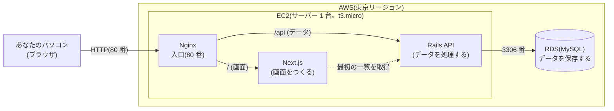
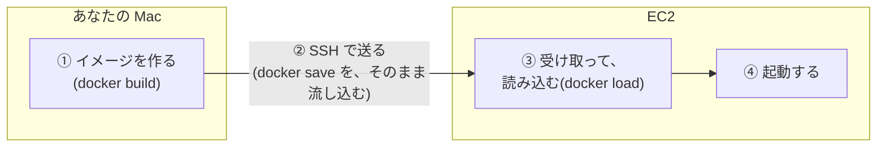
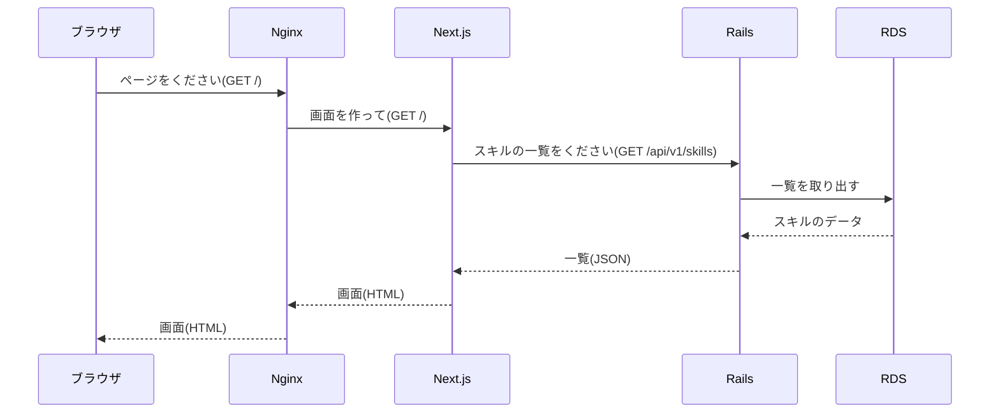
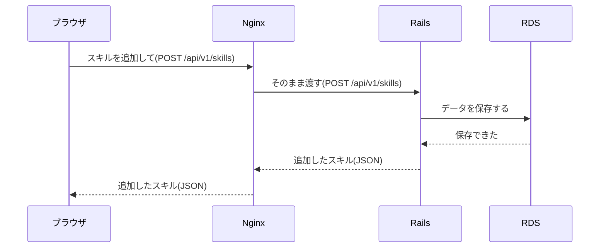
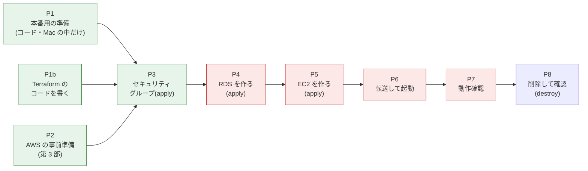
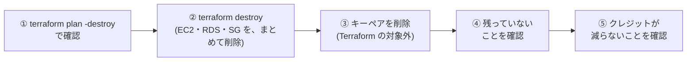

# 07. デプロイガイド

Phase 4(AWS の EC2 + RDS へのデプロイ)に入る前に、あなたが読んで、全体像と、守ることが分かるようにするためのガイドです。

> **このガイドは、5 つの部に分けて、1 部ずつ作ります。** **第 5 部まで、すべて、そろいました。**
>
> | 部 | 内容 | 状態 |
> |---|---|---|
> | 第 1 部 | 絶対に守ること、費用の仕組み | 完了 |
> | 第 2 部 | 全体像と、用語の説明 | 完了 |
> | 第 3 部 | 事前準備のチェックリスト(あなたがやること) | 完了 |
> | 第 4 部 | Phase 4 の段取り(だれが何をするか) | 完了 |
> | **第 5 部** | **後片付け、うまくいかないとき、緊急時** | **この文書** |

**このガイドを書いている時点では、AWS には、何も作っていません。**(費用は 0 です)

> **2026 年 9 月 22 日に更新: セキュリティグループ・RDS・EC2(第 4 部の P3〜P5)は、コンソールでの手動作成ではなく、Terraform で作ることにしました。** 「作る前に、画面を見せてもらって確認する」という**無料ゲートの考え方は、変わりません**。コンソールの作成画面の代わりに、**`terraform plan` の出力(何が、どんな設定で作られるか)を見せてもらって確認し、あなたが `terraform apply` を実行する**、という形になります(1.1.1 で詳しく説明します)。第 3 部(アカウントの安全設定)や、キーペアの作成、SSH でのイメージの転送(P6)など、**Terraform の対象外の部分は、これまでどおり、コンソール・手作業**です。

---

# 第 1 部: 絶対に守ること・費用の仕組み

## 1.1 絶対に守ること

**「必ず無料の範囲で行う」**ことが、いちばん大事なルールです。次の 10 か条を、Phase 4 のあいだ、いつも守ります。

| # | 守ること | 担当 |
|---|---|---|
| 1 | **「有料プランへのアップグレード(Upgrade)」は、絶対にしない。** 画面に「アップグレード」の案内が出ても、押さない | あなた |
| 2 | 自動で有料プランになる操作をしない(**AWS Organizations への参加・作成**、**IAM Identity Center の「有効にする」**(組織が、自動で作られる)、Control Tower、AWS パートナーネットワークへの参加、など。1.2 の表と、第 3 部の 3.2) | あなた |
| 3 | **作る前に、「無料ゲート」を通す**(下の 1.1.1)。**`terraform apply` の前に、`terraform plan` の出力を、私(Claude)が、あなたに見せる。あなたが「OK」と言ってから、あなたが `apply` する** | あなた+私 |
| 4 | 私は、AWS のリソースを、**勝手に作らない・変えない**。`terraform apply`・`terraform destroy`(削除)・コンソールでの操作は、**すべて、あなたが実行する**。私は、コマンドや `plan` の内容を見せて、あなたが**承認してから** | 私 |
| 5 | **最初に、予算アラート(AWS Budgets)を設定する。** 設定できたことを、私が確認してから、次に進む | あなた+私 |
| 6 | リソースを作った**直後**にも、「請求とコスト管理」の画面で、**クレジット残高**を確認する。想定外の減り方があれば、その場で止める | あなた+私 |
| 7 | **放置しない。** リソースを作る前に「いつ削除するか」を決める。使い終わったら、**その日のうちに、削除**する(削除の手順は、第 5 部) | あなた |
| 8 | **使わないと決めたもの**を、作らない: NAT ゲートウェイ、ロードバランサー、Elastic IP(固定 IP)、Route 53(ドメイン)、追加のスナップショット・AMI、複数台、マルチ AZ、大きいストレージ、有料の追加機能 | あなた+私 |
| 9 | **無料の条件は、変わることがある。** 私の記憶では、断定しない。作業の時点で、AWS の画面と、公式ページで確認する | 私 |
| 10 | **不安になったら、止める。** 「たぶん大丈夫」で、進まない。分からない表示が出たら、押さずに、私に見せる | あなた+私 |

### 1.1.1 「無料ゲート」(リソースを作る前の確認)

EC2(サーバー)、RDS(データベース)、セキュリティグループは、**Terraform で作ります**(`terraform/`)。コンソールで、いきなり「作成」を押す代わりに、次の手順を、**必ず**踏みます。

1. 私が、`terraform plan` を実行する(**`terraform apply` は、絶対に、私からは実行しません**)。`plan` は、**何も作らず**、「実行すると、何が、どんな設定で作られるか」を、表示するだけのコマンドです
2. `plan` の出力を、**あなたに、そのまま見せます**(省略しません)
3. 出力に、次がそろっているかを、一緒に確認します
   - サイズ・台数・設定が、**このガイドで決めた表どおり**(第 4 部で示します。目安: EC2 は **t3.micro を 1 台**、RDS は **db.t3.micro・シングル AZ・ストレージ 20GB 以内・自動拡張オフ・パブリックアクセスなし**)
   - **作られる数が、想定どおり**(`Plan: N to add, 0 to change, 0 to destroy` の `N`)。意図しない削除・変更(`to change`、`to destroy`)が **0 件**であること
   - リージョンが、**東京(ap-northeast-1)**であること
4. 確認できたら、**あなたが**、`terraform apply` を実行します(実行の確認(`yes`)も、あなたが入力します)。**私は、コマンドを画面に示しますが、実行はしません**
5. 実行後、AWS コンソールの「請求とコスト管理」で、**クレジット残高**を確認します(1.1 の 6)

**`plan` の内容に、少しでも分からない項目や、想定と違う項目があれば、`apply` せずに、私に確認してください。** 私も、不明な点を「たぶん大丈夫」で通しません。

> **RDS が、無料プランで作れない**とき(`terraform apply` がエラーになる、または、作られたあとの確認で、無料利用枠の対象外と分かったとき)は、`terraform destroy` で片付けてから、止めて、相談します。(代替案は、EC2 の上で、MySQL を動かす方法です。ただし、学校の指定が「EC2 + RDS」なので、その場合は、あなたが判断します)
>
> **state ファイル(`terraform/terraform.tfstate`)は、ローカル(あなたの Mac)にだけ置きます。** リモートバックエンド(S3 など)は使いません(個人プロジェクトで、シンプルにするため)。**Git にも入れません**(`.gitignore`。中に、リソースの ID などの情報が入るため)。**このファイルを、うっかり消さないでください。** 消すと、Terraform が「何も作っていない」と誤解し、既存のリソースを、もう一度作ろうとしたり、正しく削除できなくなったりします

---

## 1.2 あなたのアカウントの「無料プラン」の仕組み

あなたの AWS アカウントは、**無料プラン(クレジット方式)**です(あなたに、確認してもらいました)。次は、AWS の**公式ドキュメントで、確認した内容**です。

| 項目 | 内容 |
|---|---|
| クレジット | **$100** のクレジットが、最初に付く。決まった操作を行うと、**最大 $100 が追加**で、もらえる(合計 最大 $200) |
| 期間 | **6 か月**、または**クレジットを使い切るまで**。どちらか早いほう |
| 課金 | 無料プランの間は、**請求(あなたのお金)は、発生しない**。公式の説明(意訳): 「無料アカウントプランは、サービスを試している間、料金が発生しないことを保証する」 |
| 期間が終わると | **アカウントが自動で閉じて、リソースとデータに、アクセスできなくなる。** AWS は、データを 90 日間、保管する。90 日以内に「有料プラン」に切り替えれば、アカウントを続けられる(この場合は、通常の料金が、かかる) |
| 使えないもの | クレジットを一気に使い切りうるもの(Savings Plans、リザーブドインスタンス、一部の AWS Marketplace の商品)、ハードウェアの購入は、無料プランでは使えない |
| **自動で有料プランになる操作** | **AWS Organizations に参加する(作る)**、**IAM Identity Center を有効にする(組織が、自動で作られる)**、Control Tower を設定する、AWS パートナーネットワークに参加する、Professional Services の契約を作る、エンタープライズ契約を結ぶ、Skill Builder のチーム購読を購入する、アカウントを HIPAA・SEC 準拠に指定する。**これらは、しない**(1.1 の 2) |
| 他のクレジット | 無料プランは、他のキャンペーンのクレジットや割引の対象にならない |
| 対象の EC2 | 2025 年 7 月 15 日以降に作ったアカウントで、「無料利用枠の対象」と表示されるのは、**t3.micro、t3.small、t4g.micro、t4g.small、c7i-flex.large、m7i-flex.large**(EC2 の公式ドキュメント)。**t2.micro は対象外**(あなたのアカウントの状況と、合っています) |
| 対象のストレージ(EBS) | 対象と表示されるのは、standard、st1、sc1、gp2、gp3(公式ドキュメント)。**容量の上限は、確認できていない**(1.4) |
| 確認する場所 | AWS の「**請求とコスト管理**(Billing and Cost Management)」のホーム画面。**無料プランの期限、クレジット残高、残りの日数**が見られる |

## 1.3 「無料」の 2 つの意味 — 大事な注意

無料プランでは、「無料」に、**2 つの意味**があります。分けて考えます。

| | 意味 | このプロジェクトでの扱い |
|---|---|---|
| **① 現金の請求が 0 円** | あなたのお金は、かからない | 無料プランのままなら、**公式に保証**されている(ただし、有料プランに切り替えない場合)。**絶対に守る** |
| **② クレジットも、なるべく減らさない** | クレジットの残高は、6 か月の間の、「使える量」 | 下の「公式に書いてあること」から、**サーバーやデータベースを動かすと、その分、クレジットが減る可能性が高い**と、私は考えている(**推測**。1.4 で、作業のときに、確かめる)。だから、**動かす時間を短くして、使い終わったら、すぐ削除する** |

**公式に書いてあること(意訳)と、そこからの推測:**

- 公式の FAQ: 「無料の上限を超えると、通常の料金での課金が始まる。ただし、無料プランのアカウントは、請求書に、料金が表示されない」
- EC2 の公式ドキュメント: 2025 年 7 月 15 日以降のアカウントでは、無料の「使用量の上限」は、**クレジット($100 + 最大 $100)**で示され、「無料利用枠の上限を超えることは、できない」
- ここからの**推測**: サーバーなどを動かした分の料金は、クレジットから引かれる。クレジットがなくなると、無料プランは終わる(アカウントが閉じる)。**この引かれ方の細かい説明は、公式で確認できていない**ので、作業のときに、実際の減り方で確かめる

**具体的には:**

- EC2(サーバー)と RDS(データベース)は、**つけっぱなしにするほど、クレジットが減る**と考えてください。「請求は 0 円だから、放置してよい」では、ありません。
- クレジットが**なくなると、アカウントが閉じます**(データも、失われる)。だから、**「必要な日だけ動かして、終わったら削除する」**が、いちばん安全で、いちばんクレジットが長持ちします。
- 実際に、どのくらい減るかは、**作業のときに、クレジット残高の減り方を見て、確かめます**(1.4)。

## 1.4 確認できていないこと(作業のときに、確かめる)

公式ドキュメントを調べましたが、次のことは、**書かれていませんでした**。私の記憶や推測で、決めずに、**作業のときに、AWS の画面を見て、確かめます。**

| 確認できていないこと | 確かめ方 |
|---|---|
| **RDS(db.t3.micro、MySQL)が、無料プランで作れるか** | RDS の作成画面で、「無料利用枠」のテンプレートや、「無料プランでは利用できない」という表示が出るか。**出なければ、作らずに、相談する**(1.1.1) |
| EC2・RDS を動かすと、**クレジットが、1 時間あたり、どのくらい減るか** | 作った直後と、しばらくあとに、クレジット残高を見て、減り方を確かめる |
| EBS(ディスク)、データ転送の、無料の上限 | 作成画面の表示(無料利用枠の対象の表示、容量の表示)で確認する |
| 無料プランで、**予算アラート(AWS Budgets)を作れるか** | 第 3 部の準備のときに、実際に設定してみて、確かめる。作れなければ、クレジット残高を、こまめに見ることで代わりにする |

## 1.5 お金・クレジットが減りやすい落とし穴

AWS の一般的な仕組みとして、次の点で、思わぬ消費が起きます。(それぞれ、作業のときに、画面で確認します)

| 落とし穴 | 何が起きるか | 対策 |
|---|---|---|
| EC2 を「**停止**」しただけ | サーバーは止まるが、**ディスク(EBS)は、残り続ける** | 使い終わったら、「停止」ではなく、「**終了(Terminate)**」する |
| RDS を「**停止**」しただけ | RDS は、**停止しても、7 日たつと、自動で、再開される** | 使い終わったら、停止ではなく、「**削除**」する |
| RDS を削除するときの「**最終スナップショット**」 | 残すと、保管される(消費が続く) | 削除の画面で、**「最終スナップショットを作成」を外す**。自動バックアップも、削除する |
| **Elastic IP**(固定 IP) | 使っていないと、料金が発生する | **使わない**(接続先は、EC2 の「パブリック DNS」を使う) |
| **NAT ゲートウェイ**、ロードバランサー | 時間あたりの料金が、発生する | **使わない**(Nginx で代わりにする) |
| **スナップショット、AMI** | 保管に、料金が発生する | **作らない** |
| **RDS のストレージの自動拡張** | 知らないうちに、容量が増える | **オフにする** |
| 複数台、マルチ AZ、大きいサイズ | 消費が、増える | **1 台、シングル AZ、決めたサイズ**だけ |
| **リージョン(地域)の間違い** | 別のリージョンに、作ってしまい、気づかず、残る | **東京(ap-northeast-1)だけ**を使う。作業の前後に、画面右上のリージョンを確認する |

## 1.6 期限を決める

- 無料プランは、**アカウントを作ってから 6 か月**で、終わります(クレジットが先になくなれば、そこまで)。期限は、「請求とコスト管理」のホームで、確認できます。
- 期限が来ると、**アカウントが閉じて、AWS 上のデータが失われます。** ポートフォリオで見せたい期間を決めて、その後は、**こちらから、先に削除**します。
- **プログラムのコードは、GitHub にあるので、失われません。** AWS に残したいデータ(スキルの中身)が必要なら、削除の前に、手元に、バックアップします(第 5 部)。
- 期限が近づいたら、「有料プランに切り替えて、続ける」ことは、**しません**(1.1 の 1)。

---

## 出典(公式ドキュメント)

このガイドの、「確認済み」と書いた内容は、次の公式ドキュメントで確認しました。(2026 年 9 月に確認)

- [AWS Free Tier](https://aws.amazon.com/free/)
- [Choosing a plan(無料プランと、有料プランの違い)](https://docs.aws.amazon.com/awsaccountbilling/latest/aboutv2/free-tier-plans.html)
- [AWS Free Tier の FAQ](https://aws.amazon.com/free/free-tier-faqs/)
- [AWS Free Tier の利用規約](https://aws.amazon.com/free/terms/)
- [EC2 の無料利用枠(2025 年 7 月 15 日の前後の違い)](https://docs.aws.amazon.com/AWSEC2/latest/UserGuide/ec2-free-tier-usage.html)

> 無料の条件や、画面の名前は、変わることがあります。作業のときに、必ず、その時点の公式ページと、AWS の画面で、確認します。

---

# 第 2 部: 全体像と用語の説明

第 1 部は「守ること」でした。第 2 部では、**AWS に何が作られて、何がどうつながるのか**(全体像)と、**出てくる用語**を、説明します。

> この部に出てくる、ポート番号や名前は、**Phase 4 の作業(第 4 部の P1)で作る予定の構成**です。作るときに、変わることがあります。

## 2.1 何を、どこで動かすか

**AWS には、2 つのものを作ります**(これだけです)。

1. **EC2**(サーバー 1 台): この中で、**3 つのプログラム**(Nginx、Next.js、Rails)を動かします
2. **RDS**(データベース): スキルのデータを、保存します



- **Nginx**(エンジンエックス)は、**受付**です。ブラウザからの通信を、まず受け取って、「画面がほしい人は Next.js へ、データがほしい人は Rails へ」と、振り分けます
- **Next.js** は、画面(HTML)を作ります。**Rails** は、スキルの追加・編集・移動などの処理をして、データベースとやりとりします
- **RDS** は、AWS が管理してくれる、MySQL のデータベースです。EC2 の外にあり、**EC2 からだけ**つなげます(あなたのパソコンからも、インターネットからも、つなげません)
- 3 つのプログラムは、**Docker のコンテナ**として、EC2 の中で動きます(2.4 の用語を参照)

**ポイント: ブラウザから見えるのは、Nginx(80 番)だけです。** Next.js と Rails は、EC2 の中に隠れていて、ブラウザから、直接は、つなげません。

### あなたのパソコンと、EC2 のあいだ(アプリを送る流れ)

EC2 は、メモリが 1GB しかなく、アプリを組み立てる(ビルドする)作業には、足りないことがあります。そこで、**あなたの Mac で、アプリの「イメージ」(動かすための包み)を作って、EC2 に送ります**(第 1 部の 1.1 で決めた方針)。



- 送るのに、**AWS のイメージ置き場(ECR)は、使いません**(費用のリスクを減らすため)
- この送り方の**細かいコマンドは、第 4 部(P6)で、実際に試して確定**します

## 2.2 通信の流れ

### ① ページを開いたとき

ブラウザで、EC2 のアドレス(`http://…`)を開いたときの流れです。



- Next.js は、**サーバーの中から**、Rails に一覧をもらいます(EC2 の中のやりとりです。Nginx を通りません)
- ブラウザには、スキルが入った、完成した画面が届きます

### ② スキルを追加・編集・移動したとき

ブラウザの中の画面(JavaScript)が、**同じアドレスの `/api/…`** に、直接、依頼します。



- 画面のアドレスと、`/api` のアドレスが、**同じ場所(同じオリジン)**なので、開発中に必要だった **CORS(別の場所への通信の許可)は、本番では、要りません**
- そのために、**画面を作るとき(ビルド)に、「API の場所」を空にして作る**必要があります(`NEXT_PUBLIC_API_URL`。この値は、**ビルドのときに、画面のプログラムに、埋め込まれる**ので、あとから変えられません。第 4 部の P1 で、間違えないように扱います)

## 2.3 だれが、どこに、つなげられるか(セキュリティグループ)

AWS では、**「セキュリティグループ」**という設定で、**どこからの、どの通信を受け付けるか**を、決めます。**受け付けると書いていない通信は、すべて、はじかれます。**

| 守る対象 | 受け付ける通信 | どこから | 何のため |
|---|---|---|---|
| **EC2** | **80 番**(HTTP) | **あなたの IP アドレスだけ** | ブラウザで、アプリを開く |
| **EC2** | **22 番**(SSH) | **あなたの IP アドレスだけ** | あなたが、EC2 に入って、作業する |
| **RDS** | **3306 番**(MySQL) | **EC2 のセキュリティグループだけ** | Rails が、データベースにつなぐ |

- **「自分の IP だけ」にする**のは、このアプリに、**ログインがない**からです。もし、80 番を、世界中に開くと、URL を知った人は、だれでも、スキルを消したり、書き換えたりできてしまいます(第 1 部の決定)
- 他の人に見せたいときだけ、**その間だけ**、許可する IP を広げて、終わったら、**必ず、戻します**(手順は、第 5 部)
- **あなたの IP アドレスが、変わる**ことがあります(家のネットワークの仕組みによる)。変わると、あなたも、つなげなくなります。そのときは、セキュリティグループの、許可する IP を、更新します(第 5 部)
- RDS は、**インターネットに公開しません**(パブリックアクセスなし)。データベースの中身を見たいときは、EC2 に入って、そこから、確認します

## 2.4 用語の説明

| 用語 | 意味 | このプロジェクトでは |
|---|---|---|
| **AWS** | Amazon が提供する、インターネット上のサービスの集まり(クラウド) | 無料プランの範囲で使う(第 1 部) |
| **コンソール** | AWS を操作する、Web の管理画面 | Terraform の対象外の部分(第 3 部の準備、キーペア、SSH でのイメージの転送など)は、ここで行う |
| **Terraform** | インフラ(AWS のリソース)を、コードで作る・変える・消すための道具(IaC = Infrastructure as Code) | `terraform/` に、コードを置く。EC2・RDS・セキュリティグループを作る |
| **`terraform plan`** | 実行すると、**何が、どう変わるか**(作る・変える・消す)を、**表示するだけ**のコマンド。何も作らない | `apply` の前に、必ず実行して、私があなたに見せる(1.1.1) |
| **`terraform apply`** | `plan` の内容どおりに、**実際に AWS のリソースを作る・変える**コマンド | **あなたが**実行する(私は、実行しない) |
| **`terraform destroy`** | Terraform で作ったリソースを、**まとめて削除する**コマンド | 後片付け(第 5 部)で使う。あなたが実行する |
| **state(状態)ファイル** | Terraform が、「何を、AWS に作ったか」を覚えておく、記録用のファイル(`terraform/terraform.tfstate`) | **あなたの Mac にだけ**置く(ローカル管理)。Git に入れない。消さない |
| **リージョン** | AWS の設備がある、地域(東京、大阪、バージニアなど) | **東京(ap-northeast-1)だけ**を使う。画面の右上で、確認できる |
| **アベイラビリティゾーン(AZ)** | 1 つのリージョンの中の、離れた設備のグループ | 使うのは、**1 つだけ**(RDS は「シングル AZ」) |
| **VPC** | AWS の中の、あなた専用の、仮想のネットワーク | **最初から用意されている、標準のもの**を使う(あるかは、作業のときに確認)。新しく作らない |
| **EC2** | AWS で借りる、仮想のサーバー(コンピュータ)。1 台を「インスタンス」と呼ぶ | **1 台だけ**。Nginx、Next.js、Rails を、この中で動かす |
| **インスタンスタイプ** | サーバーの性能の種類(名前で決まる) | **t3.micro**(メモリ 1GB)。第 1 部の 1.2 の表にある、無料の対象 |
| **EBS** | EC2 の、ディスク(ハードディスクのようなもの) | EC2 と一緒に作られる。**EC2 を「終了」すると、一緒に消える**設定にする |
| **AMI** | サーバーを作るときの、元になる「OS の雛形」 | 「無料利用枠の対象」と表示されるものを、選ぶだけ。**自分では、作らない**(1.5 の落とし穴) |
| **RDS** | AWS が、管理してくれるデータベース | **MySQL**、**db.t3.micro**、**シングル AZ** を、1 つ |
| **エンドポイント** | RDS につなぐための、住所(ホスト名) | Rails に、教える(環境変数 `DB_HOST`) |
| **セキュリティグループ** | どこからの、どの通信を受け付けるかの設定(2.3) | EC2 用と RDS 用の、2 つ |
| **パブリック DNS** | EC2 に、外から届くための、名前(住所) | ブラウザで開くアドレスに使う。**EC2 を作り直すと、変わる**(固定 IP は、使わない) |
| **SSH** | 別のコンピュータに、安全に入って、コマンドを打てる仕組み | あなたのパソコンから、EC2 に入るのに使う |
| **キーペア** | SSH で入るための、「鍵」(ファイル)。持っている人だけが入れる | 作成するときに、ダウンロードする。**失くさない・Git に入れない・人に渡さない** |
| **Docker** | アプリと、動かすのに必要なものを、まとめて、どこでも同じように動かす仕組み | 開発でも使っている(Rails と MySQL)。本番でも使う |
| **イメージ / コンテナ** | イメージ = アプリの「包み(設計図)」。コンテナ = それを、実際に動かしているもの | Mac で、イメージを作り、EC2 で、コンテナとして動かす |
| **Docker Compose** | 複数のコンテナを、まとめて、起動・停止する仕組み | 本番用の設定ファイルを、P1 で作る |
| **Nginx** | 受付係のプログラム(Web サーバー)。通信を、行き先ごとに、振り分ける | 「リバースプロキシ」として使う(下) |
| **リバースプロキシ** | 外からの通信を、代わりに受け取って、中のプログラムに、振り分ける仕組み | `/api` は Rails、それ以外は Next.js へ |
| **環境変数** | プログラムに渡す、設定の値(ファイルに書かずに、外から渡す) | DB の場所、パスワードなどを、渡す |
| **秘密の値** | 人に知られてはいけない値(DB のパスワード、Rails のマスターキー) | **Git(GitHub)に入れない。** EC2 の上の、自分だけが読めるファイルに置く |
| **クレジット / 予算アラート** | 無料プランの、使える量 / 使いすぎを知らせる通知 | 第 1 部を参照 |
| **終了(Terminate)** | EC2 を、完全に消すこと(停止とは、違う) | 使い終わったら、これで消す(第 1 部の 1.5) |

## 2.5 いまの開発環境と、本番(AWS)の違い

いま、あなたのパソコンで動いている状態と、本番との、違いです。

| | いまの開発環境 | 本番(AWS) |
|---|---|---|
| 入口 | ブラウザから、画面(3000 番)と、API(3001 番)へ、**別々に**つなぐ | ブラウザからは、**Nginx(80 番)だけ**。同じアドレスで、画面も API も、届く |
| 画面(Next.js) | `next dev`(開発用。コードを変えると、すぐ反映) | **組み立て済み**(ビルド済み)のものを、コンテナで動かす |
| API(Rails) | 開発用の Docker イメージ(コードを、そのまま、読み込む) | **本番用のイメージ**(`backend/Dockerfile`)。本番の設定で動く |
| データベース | Docker の MySQL(自分のパソコンの中) | **RDS**(AWS の中)。最初は、**空**(テーブルは、Rails の起動時に、自動で作られる) |
| データ | 開発中に、作ったスキル | **引き継がない。** 本番は、空から始まる |
| CORS | 必要(3000 番から 3001 番への通信のため) | 不要(同じ場所への通信になるため) |
| API の場所の設定 | `NEXT_PUBLIC_API_URL=http://localhost:3001` | **空**(画面を作るとき) |
| 起動のしかた | `start.sh` | 本番用の Compose(EC2 の中で、起動) |
| だれが、つなげるか | 自分のパソコンだけ(`localhost`) | **自分の IP だけ**(セキュリティグループ) |
| 秘密の値 | 開発用の、簡単な値 | **本番用の、別の値**(Git に入れない) |

> この部の内容は、`docs/06-技術スタック.md`(構成図)、`backend/Dockerfile`(本番用のイメージ。既定で、80 番で待ち受け、起動時にデータベースを準備する)、`backend/config/database.yml`(本番の DB 接続は、環境変数で受け取る)、`frontend/lib/api.ts`(画面から API を呼ぶ場所の決め方)を、もとにしています。

---

# 第 3 部: 事前準備のチェックリスト(あなたがやること)

AWS でリソース(サーバーやデータベース)を作る**前**に、あなたが行う準備です。**この部の作業では、AWS のリソースは、何も作りません**(アカウントの安全設定と、確認だけです)。

## 3.1 進め方

- **1 項目ずつ**、進めます。各項目の最後に、**「私に見せるもの」**があります。それを、私(Claude)に、**文字で写して伝える**か、**スクリーンショットで見せて**ください。私が確認してから、次の項目に進みます。
- **画面の表示が、ここに書いたものと違うときは、押さずに止めて、私に見せてください。** AWS の画面の名前やボタンの位置は、変わることがあります。
- **私に送ってはいけないもの**: AWS の**パスワード**、**MFA の QR コードやシークレットキー**、**アクセスキー**、**キーペアのファイル(.pem)の中身**。画面を見せるときも、**アカウント ID とメールアドレスは、隠して**ください。
- 費用: この部の作業で、リソースは作りません。ただし、**予算アラートの作成に、料金がかかるかは、公式ページで確認できていません**(3.3 の C4)。**作成画面に、料金の表示が出たら、押さずに、私に見せてください。**

## 3.2 絶対に押さない画面・ボタン

準備のあいだも、Phase 4 のあいだも、次のボタンは、**押しません**。AWS の画面には、「おすすめ」や「始めましょう」として、案内が出ることがあります。**案内が出ても、押さずに、私に見せてください。**

| 押さないもの | 起きること(公式ドキュメントで確認) |
|---|---|
| **「IAM Identity Center」の「有効にする(Enable)」** | **AWS Organizations(組織)が、自動で作られます。無料プランが、有料プランに切り替わり、無料のクレジットが、その場で失効します**(IAM Identity Center の公式ドキュメント)。**いちばん押しやすい、危険なボタンです** |
| AWS Organizations の「組織を作成」、組織への招待の承諾 | 無料プランが、有料プランに、自動で切り替わる(第 1 部の 1.2) |
| **「プランをアップグレード(Upgrade plan)」** | 有料プランになる。通常の料金が、かかるようになる |
| AWS Control Tower の「ランディングゾーンを設定」 | 有料プランに、自動で切り替わる |
| AWS パートナーネットワークへの参加 | 有料プランに、自動で切り替わる |
| Savings Plans、リザーブドインスタンスの購入、AWS Marketplace の購読 | 無料プランでは使えない。有料プランが、必要になる |

- **ログイン用の別のユーザーは、作りません。** AWS では、ふだんの作業に、ルートユーザー(アカウントの持ち主)を使わないことが推奨されていますが、**今回は、1 人で、短い期間だけ使うので、ルートユーザーに MFA(C2)を付けて使います。** 別のユーザーを作る手順の途中で、**IAM Identity Center の案内が出やすく、上の危険なボタンに、つながる**ためです。(別のユーザーが必要だと思ったら、私に相談してください。IAM ユーザーの作り方を、確認します)
- **アクセスキーは、作りません。**(コンソールの操作だけで、進められるため)

## 3.3 チェックリスト

**C1 〜 C9 の順に**、進めます。

### C1. サインインと、リージョンの確認

| | |
|---|---|
| やること | AWS のコンソール(https://console.aws.amazon.com/)に、**ルートユーザー**として、サインインする。画面の右上の**リージョン名**が、**「アジアパシフィック(東京)」(ap-northeast-1)**になっているか、確認する。違えば、東京に切り替える |
| なぜ | 東京のリージョンだけを使う(第 1 部の 1.5)。別のリージョンに作ると、気づかずに、残ってしまう |
| 私に見せるもの | 右上のリージョン名が、東京になっている画面(アカウント ID・メールアドレスは、隠す) |

### C2. ルートユーザーの MFA(多要素認証)

| | |
|---|---|
| やること | 右上のアカウント名のメニューから、「**セキュリティ認証情報**」を開き、**MFA デバイスを割り当てる**。**認証アプリ**(スマホのアプリ)か、**パスキー**を使う。画面の案内どおりに進める |
| なぜ | パスワードだけだと、盗まれたときに、アカウントを乗っ取られて、勝手にリソースを作られ、クレジットを使い切られたりする。MFA があると、防げる |
| 注意 | **QR コードやシークレットキーは、私に送らない・GitHub に置かない。** スマホを機種変更するときのために、MFA の**バックアップの方法**を、確認しておく |
| 私に見せるもの | 「MFA が有効になっている」と分かる表示(QR コードは、写さない) |

### C3. 無料プランの表示の確認

| | |
|---|---|
| やること | 「**請求とコスト管理(Billing and Cost Management)**」のホーム画面を開く。**無料アカウントプラン**であること、**期限の日付、クレジット残高、残りの日数**を確認する |
| なぜ | 「無料プラン(クレジット方式)」であることを、画面で確かめる(第 1 部の 1.2)。以降の、減り方の基準にもなる |
| 私に見せるもの | 「プランの名前」「期限の日付」「クレジット残高($)」「残りの日数」 |

### C4. 予算アラートの設定

| | |
|---|---|
| やること | 「請求とコスト管理」→「**Budgets**」→「**予算を作成(Create budget)**」→「**テンプレートを使用する(簡易版)**」→ **「Zero spend budget(ゼロ支出予算)」**を選ぶ。予算の名前と、**通知を受け取るメールアドレス**を入れて、「予算を作成」を押す(公式ドキュメントの手順) |
| なぜ | 「Zero spend budget」は、公式の説明で、「**AWS の無料利用枠の上限を超える支出があったときに、通知する**」予算。使いすぎに、早く気づく |
| 確認できていないこと | ① 無料プランで、この予算が作れるか。② **クレジットで払われる分(クレジットが減る分)も、通知されるか**。③ 予算の作成に、料金がかかるか。**通知されないかもしれないので、アラートだけに頼らず、C6・C9 の「クレジット残高の確認」も、必ず行う**(第 1 部の 1.1 の 6) |
| 止まるとき | 作れない・料金の表示が出る・「有料プランが必要」と出る → **押さずに、私に見せる**。その場合は、クレジット残高を、こまめに見ることで代わりにする |
| 私に見せるもの | 作成後の「Budgets」の一覧の画面(メールアドレスは、隠す) |

### C5. 通知メールが、届くか

| | |
|---|---|
| やること | AWS からのメール(予算アラート、確認のメール)が、**届く**ことを確認する。**迷惑メールフォルダに入っていないか**も見る。AWS のメールを、受け取れる設定にしておく。無料プランでは、公式の説明で、**クレジット残高と、無料プランの期限が近づいたことを知らせるメールが、定期的に届く**とある(届くか、確かめる) |
| なぜ | アラートが届いても、気づかなければ、意味がない |
| 私に見せるもの | 「届いた」「迷惑メールに入っていた(直した)」などの、結果 |

### C6. クレジット残高の記録(基準)

| | |
|---|---|
| やること | **リソースを、何も作っていない、いまの**クレジット残高を、**メモ**しておく(C3 の数字) |
| なぜ | 作業のあと、残高が、どのくらい減ったかを、比べるための基準(第 1 部の 1.4 の、確認できていないこと) |
| 私に見せるもの | メモした残高($)と、日付 |

### C7. あなたの IP アドレス(私が確認します)

| | |
|---|---|
| やること | **私が、あなたの Mac から、「AWS から見た、あなたの IP アドレス」を確認します**(AWS が提供する、確認用のアドレスを使います)。作業の日に、もう一度、確認します |
| なぜ | セキュリティグループで、**あなたの IP だけ**に、80 番と 22 番を許可する(第 2 部の 2.3) |
| 注意 | ① **IP アドレスは、このガイドや GitHub には、書きません**(会話の中でだけ、伝えます)。② IP は、**回線・VPN・スマホのテザリングなどで、変わります**。AWS に登録した IP と、いまの IP が、違うと、つなげません。③ 許可するときは、「**自分の IP だけ**」を選ぶ(「どこからでも(0.0.0.0/0)」は、選ばない) |
| 私に見せるもの | (私が、伝える側です)あなたは、**作業の日の、ネットワーク(自宅の Wi-Fi など)を、教えてください** |

### C8. Mac の準備(私が確認済み)

**2026 年 9 月 22 日**に、私が、あなたの Mac で確認した結果です。**作業の日に、もう一度、確認します。**

| 項目 | 結果 |
|---|---|
| Docker が動いている | **動いている**(バージョン 29.7.2) |
| Mac の CPU の種類 | **Intel(x86_64)。EC2 の t3.micro と、同じ種類。** Mac で作ったイメージを、そのまま EC2 で動かせる(第 2 部の 2.1) |
| ディスクの空き | **約 186GB**(十分) |
| SSH のコマンド | **ある**(OpenSSH 10.3) |
| Git の状態 | **未コミットの変更は、なし**(`main`) |

### C9. 作業する日と、削除する日を決める

| | |
|---|---|
| やること | 第 1 部の 1.1 の 7(放置しない)のために、**作業する日**と、**使い終わって削除する日**を、決める。**カレンダーに、削除の予定を入れる** |
| 決める目安 | ① 作業は、**1 日で終わらせる**つもりで、時間を取る(途中で、放置しない)。② **削除は、確認が終わった、その日のうち**。③ 無料プランの**期限**(C3 の日付)を、超えない |
| 私に見せるもの | 「作業する日」「削除する日」(決まっていれば) |

| 決めること | 日付 |
|---|---|
| 作業する日 | (あなたが決める) |
| 削除する日 | (あなたが決める) |
| 無料プランの期限(C3 で確認) | (C3 で確認) |

### C10. Terraform 用の IAM ユーザーを作る

| | |
|---|---|
| やること | **ルートユーザーとは別に**、Terraform が AWS を操作するための、**IAM ユーザーを 1 つ作る**。**必要な権限だけ**(EC2・RDS・セキュリティグループ・VPC の、作成・削除・読み取り)を持つ、**ポリシーを付ける**(私が、必要な権限の一覧を案内します。「AdministratorAccess」のような、広すぎる権限は、付けない) |
| なぜ | ルートユーザーの認証情報を、Terraform(コマンドライン)に、直接、渡さないため。**万が一、認証情報が漏れたときの、被害を小さくする**ため(一般的なセキュリティの推奨) |
| 手順のあらすじ | ① IAM コンソールで、ユーザーを作る(コンソールへのサインインは、不要。**プログラムからのアクセスだけ**)② 必要な権限の、ポリシーを作って、付ける ③ **アクセスキー**(アクセスキー ID・シークレットアクセスキー)を作る |
| 秘密の値の扱い | アクセスキーは、**Mac の環境変数**(`AWS_ACCESS_KEY_ID`・`AWS_SECRET_ACCESS_KEY`)に設定する。**コードや、GitHub には、絶対に書かない**。ダウンロードした、キーの情報(CSV など)は、キーペアの `.pem` と同様に、安全な場所に保管する |
| 私に見せるもの | 作ったユーザー名、付けたポリシーの内容(**アクセスキーの値そのものは、見せない・私に伝えない**。あなたの Mac の環境変数に、あなただけが設定する) |
| 費用 | **かからない**(IAM ユーザーの作成自体は、無料) |

## 3.4 準備完了の合図

次の項目が、すべて「済み」になったら、私が「**準備 OK**」と言います。

| 項目 | 済み? |
|---|---|
| C1 サインイン、リージョンが東京 | ☐ |
| C2 ルートユーザーに MFA | ☐ |
| C3 無料プランの表示を確認(期限・残高・残りの日数) | ☐ |
| C4 予算アラートを設定(できなければ、その旨。代わりに、こまめに残高を見る) | ☐ |
| C5 通知メールが届くことを確認 | ☐ |
| C6 クレジット残高を記録 | ☐ |
| C7 あなたの IP アドレスを確認(作業の日に、もう一度) | ☐ |
| C8 Mac の準備(確認済み。作業の日に、もう一度) | ☐ |
| C9 作業する日・削除する日を決める | ☐ |
| C10 Terraform 用の IAM ユーザーとアクセスキーを作る | ☐ |
| 3.2 の「押さない画面・ボタン」を、読んだ | ☐ |

> **コードの準備(第 4 部の P1。Dockerfile などを作る作業)は、AWS を使いません。** 上の準備と、関係なく、進められます。AWS の操作(P2 以降)だけが、この準備が終わってからです。

## 3.5 うまくいかないとき(準備編)

| 症状 | 対応 |
|---|---|
| 画面の名前・ボタンが、書いてあるものと違う | **押さずに、画面を、私に見せる。** AWS の画面は、変わることがある |
| 画面が、英語になっている | 日本語のままで、問題ない。ボタンの英語名も、このガイドに、併記している |
| C4 で、予算が作れない・料金の表示が出る | 押さずに、私に見せる。代わりに、クレジット残高を、こまめに見る |
| メールが届かない | 迷惑メールフォルダを見る。AWS のアカウントに登録したメールアドレスが、いまも使えるかを、確認する |
| MFA のスマホが、使えなくなった | AWS のサインイン画面の、MFA が使えないとき用の案内から、復旧の手順に進む(手順は、その時点の公式ページで確認する) |
| 「IAM Identity Center」「Organizations」「Control Tower」の案内が出た | **押さずに、止まる。** 私に見せる(3.2) |

## この部の根拠

- **確認済み(公式ドキュメント)**: 予算テンプレート(Zero spend budget の作り方)、IAM Identity Center の有効化で、AWS Organizations が作られて、無料プランが有料プランになる注意、無料プランが有料プランに自動で切り替わる操作の一覧
  - [予算の作成(テンプレート)](https://docs.aws.amazon.com/cost-management/latest/userguide/budget-templates.html)
  - [IAM Identity Center の有効化(注意書き)](https://docs.aws.amazon.com/singlesignon/latest/userguide/enable-identity-center.html)
  - [無料プランの説明](https://docs.aws.amazon.com/awsaccountbilling/latest/aboutv2/free-tier-plans.html)
- **確認済み(あなたの Mac)**: C8 の表
- **確認できていない**: 無料プランでの、予算アラートの作成可否・通知の対象・料金。C2 の画面の細かい手順(画面の名前は、変わることがある。作業のときに、画面に合わせて、案内する)

---

# 第 4 部: Phase 4 の段取り(だれが何をするか)

Phase 4 を、**P1 〜 P8 のステップ**に分けます。**ステップを、1 つずつ**進めます。各ステップで、**だれが担当か**、**AWS を使うか**、**作る前の「無料ゲート」**、**完了の確認**、**戻し方**を、決めておきます。

## 4.1 全体の流れ

| ステップ | 内容 | 担当 | AWS を使う? | クレジットが減る? |
|---|---|---|---|---|
| **P1** | **本番用の準備**(コード。Dockerfile、Nginx の設定など)。ローカルで、本番と同じ構成を、試す | 私 | **使わない** | **減らない** |
| **P1b** | **Terraform のコードを書く**(EC2・RDS・セキュリティグループ)。`terraform plan` で、構文と内容を確かめる | 私 | 読み取りだけ(`plan` は何も作らない) | **減らない** |
| **P2** | AWS の事前準備(第 3 部の C1〜C9) | あなた | 設定・確認だけ(リソースは作らない) | 減らない |
| **P3** | セキュリティグループを作る(2 つ。`terraform apply`) | あなた(私が `plan` を見せる) | 使う | 減らない見込み(※) |
| **P4** | **RDS(データベース)を作る**(`terraform apply`) | あなた(私が `plan` を見せる) | 使う | **減り始める** |
| **P5** | **EC2(サーバー)を作る**(`terraform apply`) | あなた(私が `plan` を見せる) | 使う | **減り始める** |
| **P6** | イメージの転送と、起動 | 私(あなたは承認) | 使う | 減っている最中 |
| **P7** | 動作確認 | 私+あなた | 使う | 減っている最中 |
| **P8** | **後片付け(削除)と、確認** | あなた+私 | 使う | **ここで、止まる** |

※ セキュリティグループは、一般には無料ですが、公式では、確認できていません。作成画面に、料金の表示が出たら、押さずに、私に見せます。



- **緑(P1・P1b・P2・P3)**: クレジットが、減らない(または、ほとんど減らない)ステップ。**時間をかけて、ゆっくり進めてよい**
- **赤(P4〜P7)**: **RDS と EC2 が、動いていて、クレジットが減る**ステップ。**P8 で削除するまで、減り続ける**。だから、**P4 に入る前に、準備をすべて終わらせて、P4〜P8 を、1 日で、一気に進める**(4.4)
- **青紫(P8)**: 削除して、クレジットが減るのを**止める**ステップ。**赤のステップに入ったら、必ず、ここまで進める**。`terraform destroy` を使う(下)
- **P1・P1b は、AWS を使わない**ので、P2 と関係なく、いつでも進められる(`terraform plan` は、AWS の情報を**読み取る**ため、実は、認証情報の設定(第 3 部)が必要。読み取りだけで、何も作らない)

## 4.2 決めるサイズと設定

**サイズや設定は、ここで決めた値から、変えません。** 「画面で確認する」と書いたものは、公式ドキュメントでは確認できていないので、**作成画面の表示を、私に見せて、確認**してから、決めます(第 1 部の「無料ゲート」)。

### EC2(サーバー)

| 項目 | 決めた値 | 補足 |
|---|---|---|
| リージョン | **東京(ap-northeast-1)** | 右上で確認 |
| 台数 | **1 台** | |
| インスタンスタイプ | **t3.micro** | 公式で、無料利用枠の対象と確認済み(第 1 部の 1.2) |
| OS(AMI) | 「**無料利用枠の対象**」と表示される **Amazon Linux** の、新しいもの | **画面で確認**(公式では、「対象と表示されるものを選ぶ」とだけ、書かれている) |
| ディスク(EBS) | **標準の大きさ(8GB 前後)のまま** | 大きくしない。**画面で、無料の対象の表示を確認**。EC2 を終了するとき、**一緒に削除される設定**にする |
| キーペア | **新しく 1 つ作る**(SSH で入る鍵) | ファイルは、**Mac の安全な場所に保管**。GitHub には、入れない |
| ネットワーク | **標準の VPC**、**パブリック IP を自動で付ける** | **Elastic IP は、使わない**。標準の VPC が、あるかは、**画面で確認** |
| セキュリティグループ | **P3 で作る、EC2 用**(下) | |
| CPU クレジットの指定 | **「標準(Standard)」にする** | t3 は、**既定で「無制限(Unlimited)」**のことがあり、CPU を使い続けると、**追加の料金**が発生しうる、という一般的な仕組みがある。**画面の「高度な詳細」で、確認**して、標準にする(**画面で確認**) |
| 詳細モニタリング | **オフ** | 有料の追加機能 |
| メモリの保険 | **スワップ(ディスクを、メモリの代わりに使う設定)を、2GB** | P5 で、EC2 の中に設定する。メモリが 1GB しかないため |

### RDS(データベース)

| 項目 | 決めた値 | 補足 |
|---|---|---|
| エンジン | **MySQL** | 開発でも、MySQL 8.4 を使っている。RDS で、**同じバージョンを選べるか**は、**画面で確認**(選べなければ、私に見せて相談) |
| テンプレート | 「**無料利用枠**」があれば、それを選ぶ | **なければ、作らずに、相談**(第 1 部の 1.1.1) |
| インスタンスクラス | **db.t3.micro** | **画面で、無料の対象かを確認**(第 1 部の 1.4) |
| 配置 | **シングル AZ**(「マルチ AZ」は、選ばない) | 消費が、2 倍になる |
| ストレージ | **20GB**(最小)。**ストレージの自動スケーリングは、オフ** | 「無料の対象」の表示を、**画面で確認** |
| パブリックアクセス | **なし** | EC2 からだけ、つなぐ(第 2 部の 2.3) |
| セキュリティグループ | **P3 で作る、RDS 用**(下) | |
| DB の名前 | `backend_production` | Rails の設定(`backend/config/database.yml`)に、合わせる |
| ユーザー名 | `backend` | 同上。**パスワードは、あなたが決めて、Git に入れない**(秘密の値) |
| 自動バックアップ | **保持期間は、0 日(なし)にできれば 0。できなければ、最小** | 残ると、消費が続く。削除のとき、**「最終スナップショットを作成」を外す**(第 1 部の 1.5)。**画面で確認** |
| 削除保護 | **オフ**(あとで、削除できるように) | **コンソールから作ると、既定で「オン」になり、オンのままだと、削除できない**(公式ドキュメント)。**作成画面で、オフにする**。P8 でも、削除の前に、オフになっているかを確認する |
| 詳細モニタリング・Performance Insights | **オフ** | 有料の追加機能になりうる。**画面で確認** |

### セキュリティグループ(P3 で作る、2 つ)

| 名前(例) | 受け付ける通信 | どこから |
|---|---|---|
| `skill-map-ec2` | **80 番**(HTTP) | **あなたの IP だけ**(`/32`) |
| | **22 番**(SSH) | **あなたの IP だけ**(`/32`) |
| `skill-map-rds` | **3306 番**(MySQL) | **`skill-map-ec2` のセキュリティグループだけ** |

- **「どこからでも(0.0.0.0/0)」は、選ばない**(第 3 部の C7)
- 他の人に見せたいときだけ、80 番の許可を、その間だけ広げて、終わったら戻す(第 5 部)

### 使わない・作らないもの(再掲)

Elastic IP、NAT ゲートウェイ、ロードバランサー、Route 53、ECR(イメージ置き場)、スナップショット、AMI の作成、マルチ AZ、2 台目、追加のディスク、Performance Insights、詳細モニタリング。(第 1 部の 1.1 の 8)

## 4.3 各ステップの詳細

### P1. 本番用の準備(コード。私が担当。AWS は使わない)

| | |
|---|---|
| 目的 | 本番(EC2)で動かす、アプリの「包み」と、設定ファイルを作る。**ローカルの Mac で、本番と同じ構成を試して**、動くことを、確かめる |
| 作るもの | ① フロントエンドの Dockerfile(Next.js の本番用ビルド。`output: "standalone"`)② Nginx の設定(`/api` と `/up` は Rails へ、それ以外は Next.js へ)③ 本番用の Docker Compose ファイル(`docker-compose.prod.yml`。Nginx、Next.js、Rails の 3 つ。DB は含めない。ローカル確認専用の `docker-compose.prod.local.yml` を重ねると、MySQL のコンテナが加わる)④ 環境変数の見本(`backend/.env.production.example`、`frontend/.env.production.example`。**秘密の値は、入れない**)⑤ Rails の本番設定の確認(下) |
| Rails の本番設定で、確認すること | HTTP だけで動くか(`force_ssl` と `assume_ssl` の設定)、`config.hosts`(許可するホスト名)、DB の接続(ホスト、ユーザー、パスワードは、環境変数で渡す)、**マスターキー**(`RAILS_MASTER_KEY`。秘密の値) |
| **落とし穴** | **`NEXT_PUBLIC_API_URL` は、画面を作る(ビルドする)ときに、埋め込まれる**(第 2 部の 2.2)。**本番用は、空にして、ビルドする**。サーバー側の `API_URL` は、実行時に渡す |
| ローカルでの確認 | RDS の代わりに、**ローカルの MySQL コンテナ**を使って、Nginx 経由(1 つの入口)で、**前回の通しの確認(追加・編集・移動・優先度順・削除)**を、実際の Chrome で行う |
| 完了の確認 | ローカルで、本番と同じ構成が動き、通しの確認が、すべて通る。テスト(`npm run check`、`bin/ci`)も通る |
| 費用 | **なし**(AWS を使わない) |
| 戻し方 | コードなので、Git で、いつでも戻せる |
| 進め方 | **P1 は、小さく分けて、1 つずつ**(それぞれ、issue → ブランチ → Pull Request → あなたが、マージ): ① フロントエンドの Dockerfile ② Nginx と本番用 Compose ③ Rails の本番設定の確認 ④ ローカルでの、本番構成の通しの確認 |
| **最後に** | P1 の最後に、**本番用のイメージを、Mac で作っておく**(P6 で、すぐ送れるように。**P4 の前に、終わらせておく**) |

**ローカルで、本番構成を確認するコマンド**(リポジトリ直下で実行する):

```bash
# 1. 環境変数の見本を、実際のファイルにコピーする(初めてのときだけ)
cp backend/.env.production.example backend/.env.production
cp frontend/.env.production.example frontend/.env.production

# 2. backend/.env.production の RAILS_MASTER_KEY に、backend/config/master.key の中身を貼る
#    (DB_HOST・DB_USER・DB_PASSWORD は、docker-compose.prod.local.yml が自動で上書きするので、空のままでよい)

# 3. 起動(RDS の代わりに、ローカルの MySQL コンテナを使う)
docker compose -f docker-compose.prod.yml -f docker-compose.prod.local.yml up --build

# 4. 動作確認(別のターミナルで)
curl -s -o /dev/null -w "%{http_code}\n" http://localhost/up      # 200
curl -s http://localhost/ | grep -o 'スキルボード'                # スキルボード

# 5. 終わったら停止(ローカル確認専用の DB なので、-v を付けてデータを消してもよい)
docker compose -f docker-compose.prod.yml -f docker-compose.prod.local.yml down -v
```

`docker-compose.prod.local.yml` は、**本番(EC2)では使わない**。EC2 では、`docker-compose.prod.yml` だけを使い、DB は RDS につなぐ(`backend/.env.production` の `DB_HOST` に、RDS のエンドポイントを入れる)。

> **P1 完了(`docs/08-品質チェック結果.md` の Q7)。** ローカルで、上のコマンドどおりに本番構成を起動し、実際の Chrome で、追加・編集・ドラッグ・優先度順・削除の通しの確認がすべて通ることを確認した。セキュリティヘッダー・`FORCE_SSL` の切り替えも確認済み。
>
> 確認の途中で、**Nginx の CSP(`Content-Security-Policy`)が、Next.js のストリーミング SSR に使うインラインの `<script>` タグを、ブロックしていた**ことを見つけた(`script-src 'self'` に `'unsafe-inline'` がなかったため)。curl では、最終的な HTML の中身は正しく見えるので気づけず、**実際の Chrome で、React のハイドレーションのエラー(画面が「読み込み中」のまま固まる)として、初めて表面化した**。`nginx/nginx.conf` の CSP に `'unsafe-inline'`(script-src・style-src)を追加して直した(Next.js 公式ドキュメントの「Without Nonces」の構成にならった。nonce 方式は、動的レンダリングが必須になるなど影響が大きいため、見送った)。

### P1b. Terraform のコードを書く(コード。私が担当。AWS は使わない)

| | |
|---|---|
| 目的 | P3〜P5 で作る、EC2・RDS・セキュリティグループを、Terraform のコード(`terraform/`)にする |
| 作るもの | ① `terraform/providers.tf`(AWS プロバイダー、リージョン(東京)、Terraform 自体のバージョン)② `terraform/variables.tf`(サイズなど、変えられる値)③ `terraform/main.tf`(セキュリティグループ 2 つ、RDS、EC2。4.2 の表の値を、そのままコードにする)④ `terraform/outputs.tf`(作ったあとに知りたい値: EC2 のパブリック DNS、RDS のエンドポイント)⑤ `terraform/.gitignore`(state ファイル、`.terraform/`、`*.tfvars` に、秘密の値を書く場合はそれも、Git に入れない) |
| 認証情報 | Terraform が AWS を操作するための、IAM のアクセスキー。**あなたの、ふだんログインする「ルートユーザー」は使わない**。専用の IAM ユーザーを、最小限の権限(EC2・RDS・セキュリティグループの作成・削除)で作り、そのアクセスキーを使う(第 3 部で準備)。アクセスキーは、**環境変数(`AWS_ACCESS_KEY_ID`・`AWS_SECRET_ACCESS_KEY`)で渡し、コードには書かない** |
| **キーペア・秘密の値は、Terraform の対象外** | SSH のキーペア(P5)、DB のパスワード、`RAILS_MASTER_KEY` などの**秘密の値は、Terraform のコード(Git に入るファイル)には書かない**。DB のパスワードは、`terraform apply` のときに、**対話的に入力する**(または、`.gitignore` されたローカルの `*.tfvars` ファイルに置く) |
| 完了の確認 | `terraform init`(初期化)、`terraform validate`(構文チェック)、`terraform fmt -check`(書式チェック)が、すべて通る。`terraform plan` を実行して、**意図した内容(EC2 1台、RDS 1つ、セキュリティグループ 2つ)が、正しく表示される**(AWS の認証情報が必要。第 3 部の準備が済んでから) |
| 費用 | **なし**(コードを書くだけ。`plan` も、読み取りだけで、何も作らない) |
| 戻し方 | コードなので、Git で、いつでも戻せる |

### P2. AWS の事前準備(あなたが担当)

第 3 部の C1〜C9 です。**すべて済みになって、私が「準備 OK」と言うまで、P3 以降に、進みません。** Terraform 用の IAM ユーザー(上の P1b)も、この部で作ります。

### P3. セキュリティグループを作る(`terraform apply`。あなたが実行、私が `plan` を見せる)

| | |
|---|---|
| 目的 | 4.2 の表の、2 つのセキュリティグループを作る |
| 無料ゲート | `terraform plan` の出力を、私が見せる。**`Plan: 2 to add, 0 to change, 0 to destroy`**(セキュリティグループ 2 つだけ)であること。**「どこからでも(0.0.0.0/0)」が、コードに入っていない**こと(80 番・22 番は、**自分の IP(/32)だけ**。私が、あなたのいまの IP を確認して、コードに反映してから、`plan` を見せる) |
| 手順のあらすじ | ① 私が、あなたの**いまの IP を、確認して伝える**(第 3 部の C7)。②「セキュリティグループだけ」を対象にした `terraform plan`(`-target` で絞るか、この時点ではセキュリティグループのコードしかない状態にする)を、私が実行し、出力を見せる。③ あなたが、内容を確認して `terraform apply` を実行し、`yes` と入力する |
| 完了の確認 | `terraform apply` の出力(`Apply complete! Resources: 2 added`)と、AWS コンソールで、作った 2 つの、**受け付ける通信の一覧**を、私に見せる。私が、4.2 の表と照らして、OK を出す |
| 私に見せるもの | `terraform plan`・`apply` の出力。2 つのセキュリティグループの、「インバウンドルール」の画面(IP アドレスは、私が見て確認する。**GitHub には、書かない**) |
| 費用 | 減らない見込み(※ 4.1) |
| 戻し方 | `terraform destroy`(P8。他のリソースと、まとめて削除) |

### P4. RDS を作る(`terraform apply`。あなたが実行、私が `plan` を見せる)

| | |
|---|---|
| 目的 | データを保存する、MySQL のデータベースを、1 つ作る |
| **作る前に(4.4)** | **P1・P1b が完了していて、本番用のイメージが、Mac で作ってある**こと。**これ以降は、1 日で、P8 まで進める** |
| 無料ゲート | `terraform plan` の出力を、私が見せる。**4.2 の表の、すべての項目**が、コードに、正しく反映されているか(特に: **db.t3.micro**、**シングル AZ**、**20GB**、**自動スケーリングなし**、**パブリックアクセスなし**、**バックアップの保持期間**、**削除保護オフ**)。`Plan` に、**意図しない変更・削除が 0 件**であること。1 つでも、確認できなければ、**`apply` せずに、止まる** |
| 完了の確認 | `terraform apply` が成功し、RDS の状態が「**利用可能**」になる(作成には、数分〜十数分かかる。Terraform は、既定で、作成の完了を待つ)。`terraform output` で、**エンドポイント(接続先の名前)**が取れる(秘密ではない) |
| 私に見せるもの | `terraform plan` の出力、作成後の「クレジット残高」(**作る前の残高との差**) |
| 費用 | **ここから、クレジットが減り始める**(かもしれない。第 1 部の 1.4) |
| 戻し方 | `terraform destroy`(**最終スナップショットは、作らない設定を、コードに入れておく**)(P8) |

### P5. EC2 を作る(`terraform apply`。あなたが実行、私が `plan` を見せる)

| | |
|---|---|
| 目的 | Nginx、Next.js、Rails を、動かす、サーバーを 1 台作る。Docker を、使えるようにする |
| 無料ゲート | `terraform plan` の出力を、私が見せる。**4.2 の表の、すべての項目**が、コードに、正しく反映されているか(特に: **t3.micro**、**1 台**、**無料利用枠の対象の AMI**(AMI ID を、コードに指定する。東京リージョンの、最新の Amazon Linux の ID を、事前に調べておく)、**標準のディスク**、**パブリック IP あり・Elastic IP なし**、**セキュリティグループ = EC2 用**、**CPU クレジットが「標準」**、**詳細モニタリングがオフ**)。1 つでも、確認できなければ、**`apply` せずに、止まる** |
| 手順のあらすじ | ① キーペアだけは、**Terraform の対象外で、先にコンソールで作る**(ファイルを、安全に保管。上の P1b を参照)② `terraform apply` で、EC2 を作る(キーペアの名前を、コードで指定する)③ SSH で入る(私が、コマンドを案内)④ **Docker と Docker Compose を、インストール**する ⑤ **スワップを、2GB 設定**する(④⑤は、Terraform の `user_data`(起動時に自動で実行するスクリプト)に含めるか、SSH で入って手作業にするかを、実装のときに決める) |
| 完了の確認 | `terraform apply` が成功し、EC2 が「実行中」。SSH で入れる。`docker --version`、`docker compose version` が動く。**EC2 から、RDS につなげる**(3306 番) |
| 私に見せるもの | `terraform plan` の出力、SSH で入れた結果、クレジット残高 |
| 費用 | **クレジットが、減る**(かもしれない) |
| 戻し方 | `terraform destroy`(P8) |

### P6. イメージの転送と、起動(私が担当。あなたは承認)

| | |
|---|---|
| 目的 | Mac で作ったイメージを、EC2 に送って、起動する |
| 手順のあらすじ | ① **秘密の値**(DB のパスワード、Rails のマスターキー)を、EC2 の上の、**自分だけが読める、環境変数のファイル**(権限 600)に置く(**Git には、入れない**)② Mac から、イメージを送る(`docker save` を、SSH で流し込み、EC2 で `docker load`)③ 本番用の Compose で、起動する(Rails が、起動時に、データベースのテーブルを作る)|
| コマンドの扱い | **私が、コマンドを、あなたに見せて、あなたが承認してから、実行します**(第 1 部の 1.1 の 4)。**細かいコマンドは、ここで、実際に試して確定**する(いまは、確定していません) |
| 完了の確認 | 3 つのコンテナが、動いている。`http://<パブリック DNS>/up` が、200 を返す |
| 私に見せるもの | コンテナの状態、`/up` の結果 |
| 費用 | 減っている最中(転送は、EC2 の外への通信ではないので、通信料は、ほぼ、かからない見込み。**未確認**) |
| 戻し方 | EC2 を終了すれば、消える(P8) |

### P7. 動作確認(私+あなた)

| | |
|---|---|
| 目的 | 本番で、アプリが、正しく動くことを確かめる |
| 確認すること | ① ブラウザで、`http://<パブリック DNS>` が開く(**あなたの IP から**)② スキルの追加・編集・ドラッグ・優先度順・削除が、動く(**実際の Chrome で、私が確認**。前回の通しの確認と同じ内容)③ **データが、RDS に保存**される(再読み込みしても、残る)④ **他の IP からは、つながらない**ことの確認(私が、可能な範囲で確認。できなければ、セキュリティグループの設定の確認で代える)|
| あなたに、お願いすること | ブラウザで、実際に、触ってみる。**確認が終わったら、すぐ、P8 へ**(放置しない) |
| 費用 | 減っている最中 |

### P8. 後片付けと、確認(あなた+私)

| | |
|---|---|
| 目的 | **作ったものを、すべて削除して、クレジットが、減らなくなったことを確認する** |
| いつ | **P7 が終わった、その日のうち**(第 1 部の 1.1 の 7) |
| 手順 | `terraform destroy` を実行する。**Terraform が作ったもの(EC2・RDS・セキュリティグループ)は、これ 1 回のコマンドで、まとめて、正しい順番で削除される**(RDS を先に消さないと、EC2 用のセキュリティグループが、RDS 用から参照されたままで消せない、といった、順番の問題を、Terraform が解決してくれる)。**`destroy` も、`plan` と同じように、まず `terraform plan -destroy` で「何が消えるか」を確認してから、あなたが `destroy` を実行**する。**Terraform の対象外**のもの(キーペア)は、コンソールで、別に削除する |
| 完了の確認 | `terraform destroy` の出力(`Destroy complete! Resources: N destroyed`)。AWS コンソールでも、EC2、RDS、EBS ボリューム、スナップショット、Elastic IP が、**1 つも残っていない**ことを確認する(Terraform の対象外のものが、残っていないか)。**クレジット残高が、減らなくなった**(時間をおいて、もう一度確認) |
| 記録 | **作業前と後の、クレジット残高の差**を、記録する(第 1 部の 1.4 の「確認できていないこと」の答えになる) |

> **`terraform destroy` は、`terraform/terraform.tfstate`(ローカルの state ファイル)が、揃っていないと、正しく動きません。** state ファイルを、作業の途中で、うっかり消さない・別の場所に移さないでください(1.1.1)。

## 4.4 作業当日の流れ(クレジットを、減らさない)

クレジットが減る時間(P4〜P8)を、**なるべく短く**するために、次の順で進めます。

| 順番 | やること | クレジット |
|---|---|---|
| 前日まで | **P1・P1b 完了**(コードとイメージが、Mac にある。`terraform plan` が、正しく通る)、**P2 完了**(第 3 部が、すべて済み)、P3 完了(セキュリティグループ) | 減らない |
| 当日の最初 | ① 私が、Mac と、あなたの IP を、**もう一度確認**。② **クレジット残高を記録**(作る前) | 減らない |
| ここから開始 | **P4 RDS を作る**(作成に、数分〜十数分かかる。その間に、次の準備を、並行して進める) | 減り始める |
| | **P5 EC2 を作る** → Docker を入れる | 減る |
| | **P6 転送して起動** | 減る |
| | **P7 動作確認** | 減る |
| **同じ日に** | **P8 削除**、クレジット残高を、もう一度確認 | **止まる** |

- **途中で、うまくいかなくなったら、無理に続けず、いったん、P8(削除)まで進めて、**日を改めて、やり直す**(放置しないため)
- **昼休みや、夜をまたぐ、長い中断は、しない。** 中断するなら、その前に、P8 まで、進める

## 4.5 あなたの承認が要る場面

私は、AWS に、何も作りません。**次の場面では、あなたの、確認と承認を、必ず、もらいます。**

| 場面 | 何を承認するか |
|---|---|
| **P3・P4・P5 の、`terraform apply`** | `terraform plan` の出力を私が見せて、**私が OK と言ってから**、あなたが `apply` を実行する(無料ゲート) |
| **P6 の、コマンド実行** | 私が、実行するコマンドを見せて、**あなたが OK と言ってから**、実行する |
| **P8 の、`terraform destroy`** | `terraform plan -destroy` の出力(何が消えるか)を見せて、確認してから、あなたが `destroy` を実行する |
| **セキュリティグループの、許可の変更** | 何を、どこまで広げるか、いつ戻すかを、決めてから |
| **有料になりそうな表示が出たとき** | いつでも、**止めて**、私に見せる |

## 4.6 まだ決めていないこと(作業のときに、画面で確認する)

| 確認すること | いつ |
|---|---|
| OS(AMI)の、具体的な ID(東京リージョン、無料利用枠の対象) | P1b・P5 |
| RDS の MySQL のバージョン(8.4 を選べるか) | P1b・P4 |
| 自動バックアップを、0 日にできるか(Terraform の `backup_retention_period`) | P1b・P4 |
| 標準の VPC・サブネットの ID(Terraform のコードで、データソースとして参照する) | P1b・P3 |
| CPU クレジットの指定(t3。Terraform の `credit_specification`) | P1b・P5 |
| Terraform 用の IAM ユーザーに、必要な、最小限の権限(EC2・RDS・セキュリティグループ・VPC の読み取りと、作成・削除) | P1b・P2 |
| クレジットが、1 時間あたり、どのくらい減るか | P4〜P8 の途中で、残高を見て |
| イメージを送る、細かいコマンド | P6 |
| Docker と Docker Compose の、インストールの、具体的な手順(`user_data` に含めるか、SSH での手作業にするか) | P5 |

> **この部の根拠**: 第 1〜3 部の内容、`docs/06-技術スタック.md`、`backend/Dockerfile`(本番用のイメージ)、`backend/config/database.yml`(本番の DB の名前・ユーザー)、`backend/config/environments/production.rb`(`assume_ssl`・`force_ssl`)。**サイズや設定のうち、「画面で確認」と書いたものは、公式ドキュメントで確認できていません。** 作成画面の表示を、あなたが私に見せて、私が確認してから、決めます。

---

# 第 5 部: 後片付け・うまくいかないとき・緊急時

## 5.1 後片付け(削除)の手順 — P8

**使い終わったら、その日のうちに、すべて削除します**(第 1 部の 1.1 の 7)。**削除は、`terraform destroy` の前に、必ず `terraform plan -destroy` で「何が消えるか」を、私が見せながら、確認して進めます**(第 4 部の 4.5)。

### 削除の順番



**なぜ、まとめて削除できるか**: Terraform は、リソースどうしの依存関係(例: RDS 用のセキュリティグループは、EC2 用のセキュリティグループから参照されている)を、コードから把握しているので、**正しい順番(EC2 → RDS → セキュリティグループ)で、自動的に削除します**。手動でコンソールから削除するときのような、「参照されていて消せない」という順番の失敗が、起きにくくなります。

### ① `terraform plan -destroy` で確認する

- `terraform plan -destroy` を実行すると、**何も削除せず**、「実行すると、何が削除されるか」だけを表示する
- 出力に、**EC2・RDS・セキュリティグループの、3 種類、必要な数だけ**(`Plan: 0 to add, 0 to change, N to destroy`)が、表示されているか確認する。**意図しないリソースが、含まれていないか**も確認する

### ② `terraform destroy` を実行する

公式ドキュメントで確認した、削除の仕組み(Terraform の背後で、AWS 側に起きていること)です。

- **EC2 は、「終了(Terminate)」される。** 終了は、元に戻せない。**データは、失われる**(だから、削除の前に、必要なものは、バックアップする。5.7)。「停止(Stop)」ではなく、terminated の状態になった時点から、料金は発生しなくなる(公式)
- **RDS は、「削除」される。** `deletion_protection`(削除保護)を、Terraform のコードで、最初から `false`(オフ)にしておく(第 4 部の 4.2)ので、**コンソールでの、手動でのオフへの切り替えは、不要**。「最終スナップショットを作らない」設定(`skip_final_snapshot = true`)も、コードに入れておく。これにより、保持した自動バックアップやスナップショットが残って、削除後も課金が続く、という落とし穴を避ける
- **実行には、時間がかかることがある**(RDS の削除は、特に数分かかる)。Terraform は、既定で、削除の完了を待ってから、コマンドを終える
- `terraform destroy` の**確認**にも、`yes` の入力が必要(`apply` と同じ)。あなたが入力する
- **誤って削除したときの、RDS の復元**(削除の依頼から 6 日間、AWS サポートに連絡すれば、可能性がある。公式)は、今回は使わない前提(データを残すつもりはない)

### ③ キーペアを削除する(Terraform の対象外)

- キーペアは、Terraform で作らなかった(P1b・P5)ので、**コンソールから、別に削除する**
- EC2 コンソール →「**キーペア**」→ 作った 1 つを、削除する
- **Mac の、キーペアのファイル(.pem)も、削除する**(使えなくなった鍵を、残さない)
- **標準の VPC は、消さない**(標準のものを使うため。Terraform でも作っていない)

## 5.2 残っていないことの確認

**すべて削除したあとに、1 つずつ、画面を開いて、確認します。** 私に、それぞれの画面を見せてください。

| 確認するもの | 見る場所(画面の名前は、変わることがある) | 期待する状態 |
|---|---|---|
| EC2 インスタンス | EC2 →「インスタンス」 | すべて「terminated」(または、一覧にない) |
| **EBS ボリューム(ディスク)** | EC2 →「ボリューム」 | **1 つも、ない**。**終了のときに、一緒に消えるはずだが、残っていないか、必ず見る**(公式: 「終了時に削除する」設定のものだけが、消える) |
| **スナップショット** | EC2 →「スナップショット」、RDS →「スナップショット」 | **1 つも、ない**(RDS には、「保持された自動バックアップ」の画面もある。**そこも見る**) |
| **AMI(自分で作ったもの)** | EC2 →「AMI」 | **1 つも、ない**(作っていない) |
| **Elastic IP** | EC2 →「Elastic IP」 | **1 つも、ない**(作っていない) |
| RDS | RDS →「データベース」 | **1 つも、ない** |
| セキュリティグループ | EC2 →「セキュリティグループ」 | 「default」だけ |
| キーペア | EC2 →「キーペア」 | **1 つも、ない** |
| ロードバランサー、NAT ゲートウェイ | EC2 →「ロードバランサー」、VPC →「NAT ゲートウェイ」 | **1 つも、ない**(作っていない) |
| **ほかのリージョン** | 画面の右上で、リージョンを切り替えて、EC2 と RDS を見る。**EC2 の「グローバルビュー」**でも、リージョンをまたいで、見られる(公式ドキュメントに、記載あり) | **東京以外には、何も作っていない** |

- **確認は、東京だけでなく、ほかのリージョンも、見ます。** 間違えて、別のリージョンに作ると、気づかずに、残るためです(第 1 部の 1.5)

## 5.3 クレジットが減らなくなったことの確認

| | |
|---|---|
| やること | 削除が終わった直後と、**しばらくあと(できれば、翌日)**に、「請求とコスト管理」のホームで、**クレジット残高**を確認する |
| 期待する状態 | 削除してからは、**残高が、減らない** |
| 注意 | 残高の表示は、**すぐには、反映されない**ことがある(公式には、この画面の更新の間隔は、確認できていない。EC2 の古いドキュメントでは、1 日に 3 回の更新)。**削除の直後に、まだ減って見えても、あわてず、時間をおいて、もう一度、確認する** |
| 記録 | **作業前(C6)と、削除後の、クレジット残高の差**を、私に伝える。これが、**「クレジットが、1 時間あたり、どのくらい減るか」の答え**になる(第 1 部の 1.4)。次に、同じ作業をするときの、目安になる |
| 減り続けるとき | 5.6(緊急時)へ |

## 5.4 自分の IP が変わったとき・他の人に見せるとき

セキュリティグループは、**Terraform で管理している**ので、**コンソールから、直接、インバウンドルールを編集しない**でください。コンソールで直接変えると、AWS の実際の設定と、Terraform の state ファイルが、食い違う(「ドリフト」と呼ぶ)状態になり、次の `plan`・`apply`・`destroy` で、想定外の差分が出ることがあります。**許可する IP(送信元)を変えるときも、Terraform のコード(変数)を変えて、`plan` → `apply`** の手順を踏みます。

### 自分の IP が変わったとき(つながらなくなった)

1. 私が、あなたの**いまの IP を確認して、伝える**(第 3 部の C7)
2. `terraform/` の、IP を指定している変数(`.tfvars`、または `variables.tf` の既定値)を、いまの IP(`/32`)に、書き換える
3. `terraform plan` を実行し、**セキュリティグループの、80 番・22 番の送信元だけが、変わる**(`1 to change`)ことを、私が見せる。ほかのリソースに、変更(`to destroy` や、意図しない `to add`)がないか確認する
4. あなたが `terraform apply` を実行する。つながることを確認する

### 他の人に見せたいとき(期間を決めて、広げる)

1. **相手の IP**(`/32`)を、**80 番だけ**、Terraform のコードに、**追加**する(**22 番は、広げない**。**「どこからでも(0.0.0.0/0)」は、選ばない**)
2. `terraform plan` → `apply` で、反映する
3. **見せる時間を、決める**(例: 今日の午後だけ)。**時間が来たら、その IP を、コードから削除し、`plan` → `apply` で、戻す**
4. **戻したことを、私に見せる**(`terraform plan` を実行して、差分が 0 件であることを見せれば、確実)
5. **ログインがないので、相手は、スキルを、追加・編集・削除できてしまう**(データが、書き換わる)。**見せるだけで、いじってほしくないときは、見せる時間を、短くして、そばで、見てもらう**

## 5.5 うまくいかないとき

**まだ試していないので、「予想される原因」です。** 実際に起きたときに、私が、ログ(記録)を見て、確かめます。**分からないときは、押さずに(消さずに)、私に、画面や表示を見せてください。**

| 症状 | 予想される原因 | 確認・対応 |
|---|---|---|
| **SSH で、EC2 に入れない** | ① あなたの IP が、変わった ② キーペアのファイルの権限が、ゆるい ③ ユーザー名が、違う ④ EC2 が、起動していない | ① 5.4 ② `chmod 400` で、自分だけが読める権限にする ③ OS によって、ユーザー名が違う(画面の案内に、書いてある) ④ EC2 の状態を見る |
| **ブラウザで、`http://…` が、開かない** | ① IP が、変わった ② `https://` で開いている(このアプリは HTTP だけ)③ Nginx が、動いていない | ① 5.4 ② アドレスの先頭を、`http://` にする ③ EC2 の中で、コンテナの状態を見る |
| **「502 Bad Gateway」と出る** | Nginx は動いているが、Next.js か Rails が、動いていない | EC2 の中で、`docker compose ps` と `docker compose logs` を見て、落ちているコンテナの、ログを読む |
| **画面は出るが、スキルが出ない・追加できない**(「通信に失敗」など) | ① Rails が、動いていない ② **画面を作るときに、API の場所を「空」にし忘れた**(`NEXT_PUBLIC_API_URL` が、`localhost:3001` のまま、埋め込まれている)| ② は、ブラウザから、`localhost:3001` に、つなごうとして、失敗する。**空にして、イメージを、作り直す**(第 4 部の P1 の落とし穴) |
| **Rails が、500 エラー** | ① **マスターキー**(`RAILS_MASTER_KEY`)が、渡されていない・違う ② DB に、つながらない ③ DB のテーブルが、ない | ログを読む。① 環境変数のファイルを確認 ② 次の行 ③ Rails の起動時の、`db:prepare` の、結果を見る |
| **RDS に、つながらない** | ① セキュリティグループ(RDS 用の 3306 番が、EC2 用から、許可されているか)② エンドポイントの、書き間違い ③ ユーザー名・パスワード・DB 名の、違い(`backend`、`backend_production`)④ RDS が、まだ「利用可能」でない | EC2 の中から、MySQL クライアントで、つなぐ試しをする。私が、案内する |
| **EC2 の、メモリが足りない**(コンテナが、落ちる・動作が遅い) | メモリが 1GB しかない | スワップ(2GB)が、有効か確認。それでも足りなければ、**無理に、サイズを上げず**(有料になりうる)、私に相談 |
| **`docker load` が、遅い・途切れる** | 転送する量が、大きい・回線が、遅い | 圧縮して送る。途切れたら、やり直す。**長引くときは、P8 まで進めて、日を改める**(クレジットが、減り続けるため) |
| **「作成」を押したら、想定外の表示が出た** | 画面が、想定と違う | **止めて、私に見せる**(第 1 部の 1.1 の 10) |

> **どこかで、うまくいかなくなって、時間がかかりそうなときは、無理に続けず、P8(削除)まで進めて、日を改めます**(第 4 部の 4.4)。

## 5.6 費用・クレジットが心配になったとき(緊急時)

**あわてずに、上から順に。** 途中で、私に、状況を伝えてください。

| 順番 | やること |
|---|---|
| **1** | **落ち着いて、まず、「これ以上、増やさない」**。新しいリソースを、作らない。「アップグレード」を、押さない |
| **2** | **`terraform destroy` を実行する**(5.1 の手順)。**これが、いちばん早く、クレジットの消費を、止める方法**。`plan -destroy` での確認を省略してでも、急いで止めたいときは、その旨を私に伝える |
| **3** | 「請求とコスト管理」のホームで、**クレジット残高と、期限**を確認する(5.3)。**AWS からの、通知メール(クレジット残高、無料プランの期限が近いこと)**も、確認する(公式: 無料プランでは、定期的に、届く) |
| **4** | **5.2 の確認**で、残っているものがないか、リージョンをまたいで、確認する |
| **5** | それでも、原因が分からない・画面に入れない・請求書が来た → **私に、すぐ相談**。**AWS サポート**(コンソールの「サポート」)にも、連絡できる |
| **最後の手段** | **アカウントを閉じる**(下) |

### 最後の手段: アカウントを閉じる

**すべての消費を、確実に止めたいときの、最後の手段です。** 公式ドキュメントで確認した内容です。

- **やり方**: **ルートユーザーで**サインインし、右上のアカウント名 →「**アカウント**」→「**アカウントを閉じる(Close account)**」→ アカウント ID を入力して、確定。**コンソールからだけ、できます**(コマンドでは、できません)
- **閉じたあとの状態**: そのアカウントの、AWS のサービスには、**アクセスできなくなる**。**90 日間**は、**再開できる**(AWS サポートへの連絡と、未払いの精算が、必要)。**90 日を過ぎると、アカウントは、完全に閉じて、中のデータとリソースが、削除される**
- **注意**: 閉じる前に、**消費した分の請求は、残る**(無料プランでは、請求は、発生しない)。閉じても、**すべての地域・サービスで、すぐに閉じるとは限らず、数時間かかる**ことがある
- **閉じると、そのアカウントは、使えなくなる**(同じメールアドレスは、別のアカウントの、主なメールに、使えなくなる)。**取り返しがつきにくいので、やる前に、必ず、私に相談する**

## 5.7 バックアップ・期限が近づいたとき

- **AWS のデータは、削除するか、無料プランの期限(6 か月)が来ると、失われます**(第 1 部の 1.6)。**コードは、GitHub にあるので、失われません。**
- **スキルのデータを残したいとき**: 削除の**前に**、Mac から、次のように、取り出せます(**P7 の間に**。EC2 が動いている間だけ)。`http://<パブリック DNS>/api/v1/skills` を開くと、**スキルの一覧が、JSON で、表示される**。それを、**ファイルに保存**する(あなたの IP からだけ、開けます)。**コマンドの細かい形は、そのときに、確かめる**
- **再び、AWS で動かしたいとき**: 空の状態から、作り直す(第 4 部の P4 から)。保存した JSON は、参考にして、画面から、入れ直す
- **期限(C3 の日付)が近づいたら**: 有料プランには、**切り替えません**(第 1 部の 1.1 の 1)。使い終わっていれば、何もしなくてよい。**AWS に、何も残っていないこと(5.2)**を、確認しておく

## 5.8 参考(公式ドキュメント)

- [EC2 インスタンスの終了](https://docs.aws.amazon.com/AWSEC2/latest/UserGuide/terminating-instances.html)
- [RDS DB インスタンスの削除](https://docs.aws.amazon.com/AmazonRDS/latest/UserGuide/USER_DeleteInstance.html)
- [AWS アカウントの閉鎖](https://docs.aws.amazon.com/awsaccountbilling/latest/aboutv2/close-account.html)
- [Free Tier の使用状況の確認(クレジット残高・通知)](https://docs.aws.amazon.com/awsaccountbilling/latest/aboutv2/tracking-free-tier-usage.html)
- [EC2 の無料利用枠(グローバルビューの記載)](https://docs.aws.amazon.com/AWSEC2/latest/UserGuide/ec2-free-tier-usage.html)
- [Terraform の AWS プロバイダー(公式ドキュメント)](https://registry.terraform.io/providers/hashicorp/aws/latest/docs)

> **この部の根拠**: 上の公式ドキュメントで確認した内容(終了・削除・アカウント閉鎖・クレジットの確認)と、第 1〜4 部。**5.5 の「うまくいかないとき」は、まだ試していない、予想される原因**です。**画面の名前は、変わることがあります**。作業のときに、その時点の画面と公式ページで、確認します。
